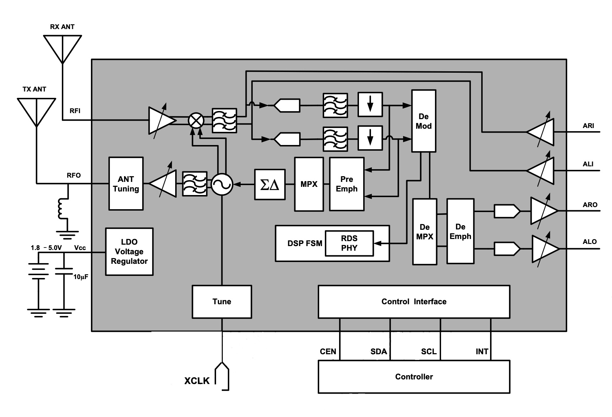
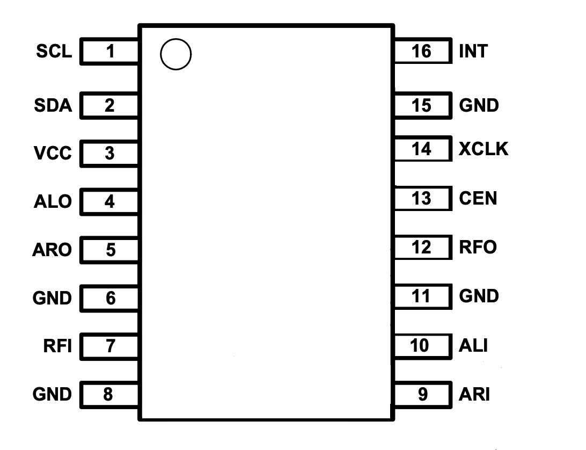

# QN8066
RX and TX FM DSP Transmitter 

UNDER CONSTRUCTION ...

## Technical Overview of the QN8066 RX/TX Device (IC)

### Introduction

The QN8066 is a highly integrated and versatile receiver/transmitter (RX/TX) device designed for use in FM radio applications. It offers a comprehensive solution for high-quality audio reception and transmission with minimal external components, making it suitable for a wide range of applications, including portable radios, automotive systems, and multimedia devices.

#### Key Features

- **Frequency Range**: The QN8066 operates over a wide frequency range, supporting FM band frequencies from 64 MHz to 108 MHz.
- **High Sensitivity**: The device is engineered to provide excellent sensitivity, allowing for clear reception of weak signals.
- **Integrated Analog and Digital Functions**: It includes both analog and digital components, ensuring compatibility with various audio formats and enhancing overall functionality.
- **Stereo Decoder**: The integrated stereo decoder ensures high-fidelity stereo audio output.
- **Low Power Consumption**: Designed with power efficiency in mind, the QN8066 is suitable for battery-powered devices, extending operational life.
- **Digital Signal Processing (DSP)**: Advanced DSP capabilities improve signal quality and reduce noise and interference.
- **Programmable Interface**: The QN8066 offers a flexible, programmable interface, enabling easy integration and customization for specific applications.

#### Technical Specifications

- **Operating Voltage**: The device operates at a typical voltage range of 2.7V to 3.6V.
- **Current Consumption**: It features low current consumption, typically around 20mA during active operation.
- **Output Power**: The output power is adjustable, catering to different transmission requirements.
- **Modulation Modes**: Supports various modulation modes including mono, stereo, and digital audio formats.
- **Interface**: I2C interface for easy communication with microcontrollers and other digital systems.

#### Functional Blocks

1. **RF Front-End**: The RF front-end is designed to efficiently capture and process FM signals, ensuring minimal loss and high-quality signal reception.
2. **PLL Synthesizer**: The phase-locked loop (PLL) synthesizer ensures stable frequency generation and accurate tuning.
3. **Audio Processing**: Includes both analog and digital audio processing units to enhance sound quality and support various audio formats.
4. **Power Management**: Advanced power management features optimize power consumption, making the QN8066 ideal for portable applications.

#### Applications

- **Portable Radios**: Due to its compact size and low power consumption, the QN8066 is ideal for portable radio applications.
- **Automotive Systems**: The high sensitivity and DSP capabilities make it suitable for in-car entertainment systems.
- **Multimedia Devices**: Compatible with a variety of audio sources, the QN8066 can be integrated into multimedia devices requiring FM reception and transmission capabilities.

## QN8066 PINOUT 

## QN8066 Pin Descriptions

| SSOP16 PIN | NAME | DESCRIPTION |
| ------- | ---- | ----------- |
| 1       | SCL  | Clock for I2C serial bus |
| 2       | SDA  | Bi-directional data line for I2C serial bus |   
| 3       | VCC  | Voltage supply |
| 4       | ALO  | Analog audio output – left channel | 
| 5       | ARO  | Analog audio output – right channel |
| 6       | GND  | Ground | 
| 7       | RFI  | FM Receiver RF input |
| 8       | GND  | Ground |
| 9       | ARI  | Right channel audio input |
| 10      | ALI  | Left channel audio input | 
| 11      | GND  | Ground |
| 12      | RFO  | Transmitter RF output – connect to matched antenna |
| 13      | CEN  | Chip enable with internal pull up: Chip power down if less than 0 |4V and VIO is powered; power up if higher voltage or left floated |
| 14      | XCLK | External clock input | 
| 15      | GND Ground | 
| 16      | INT  | Interrupt output, active low, need pull-up externally | 

## QN8066 Summary of User Control Registers

| REGISTER  | NAME          | USER CONTROL FUNCTIONS |
| --------- | ------------- | ---------------------- | 
| 00h       | SYSTEM1       |  Sets device modes     |
| 01h       | SYSTEM2       |  Sets external clock type and CCA parameters |
| 02h       | CCA           | Sets CCA parameters |
| 03h       | SNR           | Estimate RF input CNR value |
| 04h       | RSSISIG       | In-band signal RSSI dBµ V value |
| 05h       | CID1          | Device ID numbers |
| 06h       | CID2          | Device ID numbers |
| 07h       | XTAL_DIV0     | Frequency select of reference clock source |
| 08h       | XTAL_DIV1     | Frequency select of reference clock source |
| 09h       | XTAL_DIV2     | Frequency select of reference clock source |
| 0Ah       | STATUS1       | System status |
| 0Bh       | RX_CH         | Lower 8 bit of 10-bit receiver channel index |
| 0Ch       | CH_START      | Lower 8 bits of 10-bit channel scan start channel index |
| 0Dh       | CH_STOP       | Lower 8 bits of 10-bit channel scan stop channel index |
| 0Eh       | CH_STEP       | Channel scan frequency step | Highest 2 bits of receiver channel indexes |
| 0Fh       | RX_RDSD0      | RDS data byte 0 |
| 10h       | RX_RDSD1      | RDS data byte 1 |
| 11h       | RX_RDSD2      | RDS data byte 2 |
| 12h       | RX_RDSD3      | RDS data byte 3 |
| 13h       | RX_RDSD4      | RDS data byte 4 |
| 14h       | RX_RDSD5      | RDS data byte 5 |
| 15h       | RX_RDSD6      | RDS data byte 6 |
| 16h       | RX_RDSD7      | RDS data byte 7 |
| 17h       | STATUS2       | Receiver RDS status indicators |
| 18h       | VOL_CTL       | Audio volume control |
| 19h       | INT_CTRL      | Receiver RDS control
| 1Ah       | STATUS3       | Receiver audio peak level and AGC status |
| 1Bh       | TXCH          | Lower 8 bit of 10-bit transmitter channel index |
| 1Ch       | TX_RDSD0      | Transmit RDS data byte0 |
| 1Dh       | TX_RDSD1      | Transmit RDS data byte1 |
| 1Eh       | TX_RDSD2      | Transmit RDS data byte2 |
| 1Fh       | TX_RDSD3      | Transmit RDS data byte3 |
| 20h       | TX_RDSD4      | Transmit RDS data byte4 | 
| 21h       | TX_RDSD5      | Transmit RDS data byte5 |
| 22h       | TX_RDSD6      | Transmit RDS data byte6 |
| 23h       | TX_RDSD7      | Transmit RDS data byte7 |
| 24h       | PAC           | PA output power target control | 
| 25h       | FDEV          | Specify total TX frequency deviation |
| 26h       | RDS           | Specify transmit RDS frequency deviation | 
| 27h       | GPLT          | Transmitter soft chip threshold, gain of TX pilot | 
| 28h       | REG_VGA       | TX AGC gain | 

