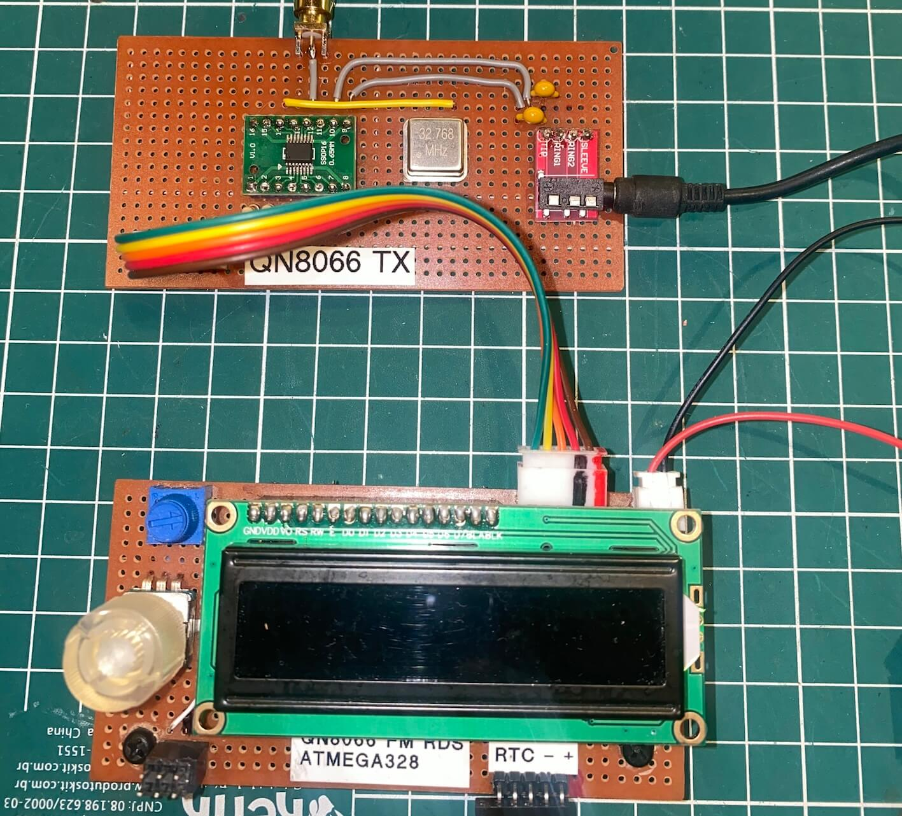
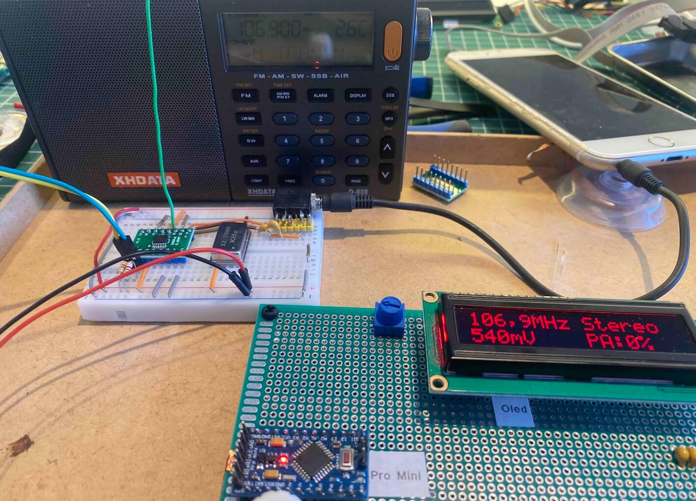
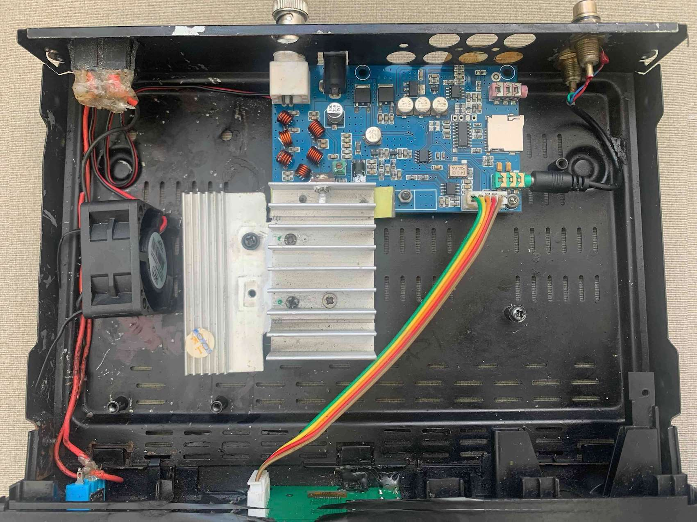

# [QN8066 FM DSP RX/TX  Arduino Library](https://pu2clr.github.io/QN8066/)

This library is intended to provide an easy-to-use interface for controlling the QN8066 FM transceiver and receiver. 

The primary goal of this Arduino library project for the QN8066 is to simplify the development of robust applications using this device. I hope that hobbyists, electronics technicians, radio amateurs, and others interested in this work will find success in their projects. All the C/C++ funcions and methods are documented [here].(https://pu2clr.github.io/QN8066/extras/apidoc/html/index.html)


This library can be freely distributed using the [MIT Free Software model](https://github.com/pu2clr/QN8066/blob/main/LICENSE). 
By using or installing Library you are agreeing to the terms of the [MIT licence](https://github.com/pu2clr/QN8066/blob/main/LICENSE). 

[Copyright (c) 2024 Ricardo Lima Caratti](https://github.com/pu2clr/QN8066/blob/main/LICENSE). 

Contact: __pu2clr@gmail.com__.


## About Me

I hold a Master's degree in Educational Technology from the Federal University of Ceará, where I delved into the ways technology can enhance learning experiences. My passion for computer science led me to specialize in it, focusing on Distributed Systems Development with an Object-Oriented approach, at the University of Brasília. My academic journey began with a Bachelor's degree in Information Systems from the União Pioneira de Integração Social (UPIS-Brasília). Outside the classroom, my main hobbies are electronics and Amateur Radio. 

## Notice to Users Regarding this Library

*This library is continuously evolving, with both corrective and feature updates. While the implemented functions have been tested, it is possible that in certain situations, the library may exhibit unexpected behavior. I encourage users to always utilize the latest release of this library. Should you encounter any issues, please feel free to contact me at pu2clr@gmail.com. I will do my best to address or clarify any problems as quickly as possible. Thank you.*


## Contents

1. [Legal Compliance Guidelines](./#legal-compliance-guidelines)
2. [QN8066 Arduino Library Features](./#qn8066-arduino-library-features)
2. [Technical Overview of the QN8066 RX/TX Device (IC)](./#technical-overview-of-the-qn8066-rxtx-device-ic)
3. [Why a QN8066 library for Arduino?](./#why-a-qn8066-library-for-arduino)
4. [Groups and Forums](./#groups-and-forums)
5. [QN8066 Functional Blocks](./#qn8066-functional-blocks)
6. [QN8066 PINOUT](./#qn8066-pinout)
7. [QN8066 Summary of User Control Registers](./#qn8066-summary-of-user-control-registers)
8. [QN8066 and Arduino based on ATmega328 or LGT8F328](./#qn8066-and-arduino-based-on-atmega328-or-lgt8f328)
9. [Homemade setup with the QN8066](./#homemade-setup-with-the-qn8066)
10. [DIY Kit 5W-7W FM Transceiver](./#diy-kit-5w-7w-fm-transceiver)
11. [Arduino Library Documentation](https://pu2clr.github.io/QN8066/extras/apidoc/html/index.html)
12. [**Arduino Sketch examples**](https://github.com/pu2clr/QN8066/tree/main/examples)
13. [Boards where this library can be compiled](./#boards-where-this-library-can-be-compiled)
14. [Donate](./#donate)
15. [Most Frequent Problems](./#most-frequent-problems)
16. [References](./#references)

## Legal Compliance Guidelines

### Important Notice

Please, be aware that the use of FM transmitters is regulated by the laws and regulations of each country. **It is crucial to ensure that your use of any FM transmitter complies with the applicable legal requirements and does not violate any broadcasting regulations**.

### Legal Compliance Guidelines

1. **Frequency Range**: Ensure that the frequency range used by your FM transmitter is permitted in your country.
2. **Transmission Power**: Adhere to the maximum allowed transmission power to avoid interference with licensed broadcasters and other communication services.
3. **Licensing**: Check if a license is required to operate an FM transmitter in your region. Obtain the necessary permissions if required.
4. **Interference**: Avoid causing interference with other electronic devices and communication services. Ensure your setup follows the prescribed technical standards.
5. **Public Safety**: Be mindful of public safety and ensure your use of the FM transmitter does not pose any risks.

By following these guidelines, you can ensure that your use of the FM transmitter respects the laws and regulations of your country and does not result in any legal issues.

# Groups and Forums

There is a Facebook group called [QN80XX FM Transmitters & Receivers Enthusiasts](https://www.facebook.com/groups/qn80xx)  where the purpose is exchanging experiences with projects based on Quintic QN80XX IC family. You will be welcome there.


## Acknowledgements

* __Mr. Grazianny Carvalho Tavares__ - I would like to thank Mr. Grazianny Carvalho Tavares, PU7MGR, for introducing me to the QN8066 and encouraging me to develop this library. Mr. Grazianny also played a crucial role in helping me understand various concepts about FM modulation, audio quality criteria, as well as in testing the fundamental functions implemented in this library using equipment for precise value measurements.

* I would like to thank Mr. __Adam Fabio__ for his article published in the online magazine [Hackaday](https://hackaday.com) titled *[Be Your Own DJ With QN8066 And An Arduino Library](https://hackaday.com/2024/08/10/be-your-own-dj-with-qn8066-and-an-arduino-library/)*.

* I would like to thank Mr. __Gareth Halfacree__ for his article published in the online magazine  [hackster.io](https://www.hackster.io) titled *[Ricardo Lima Caratti's Handy Arduino Library Delivers Easy QN8066-Powered FM Radio Projects](https://www.hackster.io/news/ricardo-lima-caratti-s-handy-arduino-library-delivers-easy-qn8066-powered-fm-radio-projects-474213406313)*.

* Mr. Elionaldo Gomes da Silva, PY2EGS, to share his [board Layout project with Nano and LCD](./extras/schematics/NANO_LCD16x2_BOARD/)

## Why a QN8066 library for Arduino?

Technically, no Arduino application strictly requires a library. In some cases, avoiding libraries might even be the right decision. However, there are several compelling reasons to consider using them.

Libraries often simplify the design and maintenance of code, and they can make your projects more portable by implementing the necessary functionality across multiple hardware platforms.

For example, if you want to use an LCD or another display device in a project that monitors temperature and atmospheric pressure, there are many excellent libraries available for Arduino users. These libraries usually include most, if not all, of the features you might need. Re-inventing the wheel by not using a library generally doesn't make sense—unless you need a feature that no existing library supports. Using a library is often the smarter choice, particularly when it can simplify porting your code to different hardware.

Utilizing a library can reduce programming complexity and enhance the robustness of your application. It simplifies life not only for other developers but also for yourself. You don't need to be a software engineer to see the value in this. A library is similar to an integrated circuit (IC); while you could manually implement the functionality of many ICs in a circuit, doing so would significantly increase the cost, complexity, size, and potential for failure of your project. Often, it's better to abstract certain functions inside a ready-made IC. The user only needs to know how to interact with the chip, not how the chip itself is designed.

Finally, if you're already using libraries to handle the I2C bus (Wire.h), TFT or OLED displays, SPI devices, and Serial UART communication, it makes sense to use a library to manage the QN8066 device as well. The QN8066 Arduino Library can add convenience, development speed, and robustness to your project. Unlike closed-source solutions, this library is open-source, allowing you to learn from and modify the code as needed.


### Efficient Use of Libraries in Microcontroller Applications

Among the common myths about using this library alongside others is the assumption that it could significantly increase the final code size, making the application unfeasible for many microcontrollers. However, it is essential to highlight that, although the library contains extensive code, a large portion serves to provide directives to the C/C++ compiler and does not necessarily translate into executable code. Examples include type definitions (typedef), data structures (struct), and unions (union). Additionally, modern compilers and linkers offer powerful optimization features, notably [Link Time Optimization (LTO)](https://gcc.gnu.org/projects/lto/lto.pdf), which eliminates unused symbols and code, ensuring the final binary is lean and efficient. These optimizations, combined with dead code elimination and [inlining strategies](https://ethz.ch/content/dam/ethz/special-interest/infk/ast-dam/documents/Theodoridis-ASPLOS22-Inlining-Paper.pdf), reduce the overhead, making the use of complex libraries feasible even in resource-constrained environments.

In light of this, to make the most of your application, it is essential to have a deep understanding of the microcontroller architecture you are working with, as well as the tools you are using, such as the compiler and linker.


#### See also: 

 * [Inline Functions](https://isocpp.org/wiki/faq/inline-functions)
 * [Understanding and Exploiting Optimal Function Inlining](https://ethz.ch/content/dam/ethz/special-interest/infk/ast-dam/documents/Theodoridis-ASPLOS22-Inlining-Paper.pdf)
 * [Inline C++ code in embedded applications](https://blogs.sw.siemens.com/embedded-software/2020/07/20/inline-c-code-in-embedded-applications/)
 * [LLVM Link Time Optimization: Design and Implementation](https://llvm.org/docs/LinkTimeOptimization.html#llvm-link-time-optimization-design-and-implementation)
 * [What is Link Time Optimization (LTO)](https://developer.arm.com/documentation/101458/2404/Optimize/Link-Time-Optimization--LTO-/What-is-Link-Time-Optimization--LTO-)
 * [Link-Time Optimization in GCC: Requirements and High-Level Design](https://gcc.gnu.org/projects/lto/lto.pdf)
 * [How to use the typedef struct in C](https://www.educative.io/answers/how-to-use-the-typedef-struct-in-c)
 * [Structures, Typedef and Union in C Programming](https://binaryupdates.com/structures-typedef-union-in-c-programming/)
 * [Bit Fields in C](https://www.geeksforgeeks.org/bit-fields-c/)


## QN8066 Arduino Library Features

This library uses the I²C communication protocol and implements most of the functions offered by QN8066 IC from QUINTIC. This library also has primitive functions that make it easier for you to implement commands that may not have been implemented yet. As said before, this library is constantly improving. Check the API documentation before implementing a new function. It is likely that your function is already implemented. [See the API documentation for this library](https://pu2clr.github.io/QN8066/extras/apidoc/html/index.html). 

1. **Open Source**. It is free. You can use, copy, modify, merge, publish, distribute, sublicense, and/or sell copies of the Software. See [MIT License](https://github.com/pu2clr/QN8066/blob/main/LICENSE) to know more.   
2. Built based on QN8066 Datasheet
3. C++ Language and Object-oriented programming. You can easily extend the QN8066 class by adding more functionalities. 
4. **API Documentation**. All functions implemented in this library have documentation that can be checked in the source code or at this [link](https://pu2clr.github.io/QN8066/extras/apidoc/html/index.html)
4. Available on Arduino IDE (via Manage Libraries). Easy to install and use. 
5. **Cross-platform**. You can compile and run this library on most of boards supported by the Arduino IDE (Examples: ATtiny85, boards based on ATmega328 and ATmega-32u4, ATmega2560, ARM Cortex, STM32, Arduino DUE, ESP32 and more). 
6. Simplifies projects based on QN8066
7. [A lot of examples to guide the user](https://github.com/pu2clr/QN8066/tree/master/examples)
8. RDS support
9. **Clock reference selection** - The QN8066 has a pin (XCLC) that should be used to inject a signal that will be utilized by the IC as a reference clock. This signal can be 32.768 kHz or a multiple of this value. This library allows you to adapt your project to the active crystal you have available. See below for more details about it. 


## Technical Overview of the QN8066 RX/TX Device (IC)

### Introduction

The QN8066 is a highly integrated and versatile receiver/transmitter (RX/TX) device designed for use in FM radio applications. It offers a comprehensive solution for high-quality audio reception and transmission with minimal external components, making it suitable for a wide range of applications, including portable radios, automotive systems, and multimedia devices.

#### Key Features

- **Frequency Range**: The QN8066 operates over a wide frequency range, supporting FM band frequencies from 64 MHz to 108 MHz.
- **High Sensitivity**: The device is engineered to provide excellent sensitivity, allowing for clear reception of weak signals.
- **Integrated Analog and Digital Functions**: It includes both analog and digital components, ensuring compatibility with various audio formats and enhancing overall functionality.
- **Stereo Decoder**: The integrated stereo decoder ensures high-fidelity stereo audio output.
- **Low Power Consumption**: Designed with power efficiency in mind, the QN8066 is suitable for battery-powered devices, extending operational life.
- **Digital Signal Processing (DSP)**: Advanced DSP capabilities improve signal quality and reduce noise and interference.
- **Programmable Interface**: The QN8066 offers a flexible, programmable interface, enabling easy integration and customization for specific applications.

#### Technical Specifications

- **Operating Voltage**: The device operates at a typical voltage range of 2.7V to 3.6V.
- **Current Consumption**: It features low current consumption, typically around 20mA during active operation.
- **Output Power**: The output power is adjustable, catering to different transmission requirements.
- **Modulation Modes**: Supports various modulation modes including mono, stereo, and digital audio formats.
- **Interface**: I2C interface for easy communication with microcontrollers and other digital systems.

#### Applications

- **Portable Radios**: Due to its compact size and low power consumption, the QN8066 is ideal for portable radio applications.
- **Automotive Systems**: The high sensitivity and DSP capabilities make it suitable for in-car entertainment systems.
- **Multimedia Devices**: Compatible with a variety of audio sources, the QN8066 can be integrated into multimedia devices requiring FM reception and transmission capabilities.


## QN8066 Functional Blocks


1. **RF Front-End**: The RF front-end is designed to efficiently capture and process FM signals, ensuring minimal loss and high-quality signal reception.
2. **PLL Synthesizer**: The phase-locked loop (PLL) synthesizer ensures stable frequency generation and accurate tuning.
3. **Audio Processing**: Includes both analog and digital audio processing units to enhance sound quality and support various audio formats.
4. **Power Management**: Advanced power management features optimize power consumption, making the QN8066 ideal for portable applications.

### Attention

* __The Logic signals level of the QN8066 device (CEN, SCL, SDA, to GND) works from 1.6V to 3.6V (see Datasheet, ELECTRICAL SPECIFICATIONS, section Recommended Operating Conditions). If you are using a 5V Arduino board, that Arduino will send 5V signals to the QN8066 device through the digital pins and the I2C bus. That configuration can make the system unstable or damage the QN8066 device. To fix this, use a logic shifter chip that converts between 3.3V and 5V logic.__  


## QN8066 PINOUT 


### QN8066 Pin Descriptions

| SSOP16 PIN | NAME | DESCRIPTION |
| ------- | ---- | ----------- |
| 1       | SCL  | Clock for I2C serial bus |
| 2       | SDA  | Bi-directional data line for I2C serial bus |   
| 3       | VCC  | Voltage supply |
| 4       | ALO  | Analog audio output – left channel | 
| 5       | ARO  | Analog audio output – right channel |
| 6       | GND  | Ground | 
| 7       | RFI  | FM Receiver RF input |
| 8       | GND  | Ground |
| 9       | ARI  | Right channel audio input |
| 10      | ALI  | Left channel audio input | 
| 11      | GND  | Ground |
| 12      | RFO  | Transmitter RF output – connect to matched antenna |
| 13      | CEN  | Chip enable with internal pull up: Chip power down if less than 0 |4V and VIO is powered; power up if higher voltage or left floated |
| 14      | XCLK | External clock input | 
| 15      | GND Ground | 
| 16      | INT  | Interrupt output, active low, need pull-up externally | 


## QN8066 Summary of User Control Registers

| REGISTER  | NAME          | USER CONTROL FUNCTIONS |
| --------- | ------------- | ---------------------- | 
| 00h       | SYSTEM1       |  Sets device modes     |
| 01h       | SYSTEM2       |  Sets external clock type and CCA parameters |
| 02h       | CCA           | Sets CCA parameters |
| 03h       | SNR           | Estimate RF input CNR value |
| 04h       | RSSISIG       | In-band signal RSSI dBµ V value |
| 05h       | CID1          | Device ID numbers |
| 06h       | CID2          | Device ID numbers |
| 07h       | XTAL_DIV0     | Frequency select of reference clock source |
| 08h       | XTAL_DIV1     | Frequency select of reference clock source |
| 09h       | XTAL_DIV2     | Frequency select of reference clock source |
| 0Ah       | STATUS1       | System status |
| 0Bh       | RX_CH         | Lower 8 bit of 10-bit receiver channel index |
| 0Ch       | CH_START      | Lower 8 bits of 10-bit channel scan start channel index |
| 0Dh       | CH_STOP       | Lower 8 bits of 10-bit channel scan stop channel index |
| 0Eh       | CH_STEP       | Channel scan frequency step | Highest 2 bits of receiver channel indexes |
| 0Fh       | RX_RDSD0      | RDS data byte 0 |
| 10h       | RX_RDSD1      | RDS data byte 1 |
| 11h       | RX_RDSD2      | RDS data byte 2 |
| 12h       | RX_RDSD3      | RDS data byte 3 |
| 13h       | RX_RDSD4      | RDS data byte 4 |
| 14h       | RX_RDSD5      | RDS data byte 5 |
| 15h       | RX_RDSD6      | RDS data byte 6 |
| 16h       | RX_RDSD7      | RDS data byte 7 |
| 17h       | STATUS2       | Receiver RDS status indicators |
| 18h       | VOL_CTL       | Audio volume control |
| 19h       | INT_CTRL      | Receiver RDS control
| 1Ah       | STATUS3       | Receiver audio peak level and AGC status |
| 1Bh       | TXCH          | Lower 8 bit of 10-bit transmitter channel index |
| 1Ch       | TX_RDSD0      | Transmit RDS data byte0 |
| 1Dh       | TX_RDSD1      | Transmit RDS data byte1 |
| 1Eh       | TX_RDSD2      | Transmit RDS data byte2 |
| 1Fh       | TX_RDSD3      | Transmit RDS data byte3 |
| 20h       | TX_RDSD4      | Transmit RDS data byte4 | 
| 21h       | TX_RDSD5      | Transmit RDS data byte5 |
| 22h       | TX_RDSD6      | Transmit RDS data byte6 |
| 23h       | TX_RDSD7      | Transmit RDS data byte7 |
| 24h       | PAC           | PA output power target control | 
| 25h       | FDEV          | Specify total TX frequency deviation |
| 26h       | RDS           | Specify transmit RDS frequency deviation | 
| 27h       | GPLT          | Transmitter soft chip threshold, gain of TX pilot | 
| 28h       | REG_VGA       | TX AGC gain | 


## QN8066 and Arduino based on ATmega328 or LGT8F328

The following electrical circuit presents the basic interface configurations of the QN8066 device with an Arduino microcontroller based on the ATmega328 or equivalent, such as the LGT8F328.


**ATTENTION:** 
The QN8066 datasheet specifies a maximum digital interface voltage (SCL, SDA, INT, and CE) of 3.6V. Therefore, it's recommended to use Arduino boards that operate at 3.3V. In tests conducted by the author of this library, the Arduino Nano, which operates at 5V, worked without issues. However, it's important to note that this practice is not recommended and may pose a risk of damaging the QN8066. Alternatives include the LGT8F328 (a cheaper Nano-compatible version) and the Arduino Pro Mini (8MHz), both of which operate perfectly at 3.3V. Important: The author of this library is not responsible for any damages that may occur in your experiments based on the information shared in this documentation.


**The QN8066 depends on an active crystal (oscillator) for its operation. Although this library is configured for a 32.768 MHz crystal by default, it offers flexibility to accommodate other active crystal or signal generator frequencies. The following section outlines a few oscillator options suitable for the QN8066.**


## Homemade setup with the QN8066

The following figures illustrate a homemade setup with the QN8066. As you can see, only a few components are needed to build an FM transmitter with the QN8066. The goal here is provide a visual representation of a basic QN8066 circuit assembled on a breadboard. It's important to note that a 32.768 MHz active crystal is utilized in this particular setup.


The diagram below presents a fundamental setup of the QN8066 interfaced with an ATmega328 microcontroller.




The next prototype uses a 32.768 kHz active crystal, not a 32.768 MHz one. Even with a simpler setup, the circuit worked as expected. Both prototypes demonstrate how few components are needed for this system. 





Through some functions in the Arduino library, you can configure the active crystal you intend to use. Check the setup and begin functions for more details. 

The table below shows some tested sources (active crystal or signal generator) and divider values. 

|   Source (kHz)  | Divider       | 
| --------------  | ------------- |
|  32.768         |      1        | 
|  < 1,310.720    | did not work  |   
|  1,310.720      |    40         | 
|  1,638.400      |    50         | 
|  3,276.800      |   100         | 
|  13,107.200     |   400         | 
|  16,384.000     |   500         | 
|  32,768,000     |  1000         |  


**IMPORTANTE:** As far as I understand, there is no possibility of using passive crystals. The QN8066 requires an active signal source provided by a generator.


#### Example 1

```cpp
/**

This sketch works on Arduino Pro Mini, Nano, UNO, or any other board based on the ATMega328. 
IMPORTANTE: Refer to the documentation if you are using a 5V microcontroller instead of a 3.3V one.

This sketch illustrates the clock configuration used on the XCLK pin of the QN8066. 
Depending on the active crystal or signal generator you are using, it is important 
to set the correct frequency and signal waveform type for the QN8066 to function 
properly.

IMPORTANT: The QN8066 works with active crystals or signal generators. 
           Passive crystals will not work with the QN8066.

Author: Ricardo Lima Caratti (PU2CLR) - 2024
*/

#include <QN8066.h>
#define FREQUENCY 1069 // 106.9 MHz 
QN8066 tx;
char str[80];
void setup() {
  Serial.begin(9600);
  while (!Serial) ;
  delay(100); // Wait a bit while the system stabilizes.
  if (!tx.detectDevice()) {
    Serial.println("\nDevice QN8066 not detected");
    while (1);
  }
  // The call to the setup function below illustrates the use of a 32.768 kHz crystal. 
  // Since the reference clock for the QN8066 is exactly 32.768 kHz, you can provide the 
  // frequency value of the crystal you are using divided by 32.768. 
  // For example: if you are using a 32.768 kHz active crystal, then you should provide the 
  // divisor value of 1. If the signal generator (active crystal) produces a sine wave, 
  // enter the value 0, and if it is a digital signal, you should enter the value 1. See below.  
  tx.setup(1,      // Divider based on frequency select of reference clock source. The crystal used here is 32.768 kHz  
           false,  // Mono False => TX will start in stereo mode
           false,  // TX will start in RDS OFF
               1,  // PreEmphasis = 75
               1); // 1 if XCLK pin is receiving a digital clock. set it to 0 if you are using a sine-wave oscillator. 

  tx.setTX(FREQUENCY);    // Chenge the FREQUENCY constant if you want other value
  sprintf(str, "\n\nBroadcasting...");
  Serial.print(str);
}
void loop() {
    sprintf(str,"\nFSM: %d\nAudio Peak: %d mV", tx.getFsmStateCode(), tx.getAudioPeakValue());
    Serial.print(str);
    tx.resetAudioPeak();
    delay(15000);
}
```

#### Example 2

```cpp

#include <QN8066.h>
#define FREQUENCY 1069   // 106.9 MHz 
QN8066 tx;
char str[80];
void setup() {
  Serial.begin(9600);
  while (!Serial) ;
  delay(100); // Wait a bit while the system stabilizes.
  if (!tx.detectDevice()) {
    Serial.println("\nDevice QN8066 not detected");
    while (1);
  }
  tx.begin();
  // Assuming you are using a 32.768 kHz active crystal, a digital signal, and LO<RF, 
  // the image is on the lower side.
  tx.setXtal(1,1,0); 
  // tx.setXtal(100,1,0); // If you are using 3,768 active crystal
  // tx.setXtal(1000,1,0); // If you are using 32,768,000 active crystal
  delay(100);
  tx.setTX(FREQUENCY);    // Chenge the FREQUENCY constant if you want other value
  sprintf(str, "\n\nBroadcasting...");
  Serial.print(str);
}
void loop() {
    sprintf(str,"\nFSM: %d\nAudio Peak: %d mV", tx.getFsmStateCode(), tx.getAudioPeakValue());
    Serial.print(str);
    tx.resetAudioPeak();
    delay(15000);
}
```

## DIY Kit 5W-7W FM Transceiver

It is possible to find Transceivers based on the QN8066 in kit form. With this library, you will also be able to control this kit, thereby expanding its original functionalities. Check AliExpress and others to check it out. 

The images below show the DIY Kit 5W-7W FM Transceiver available on AliExpress.


### DIY Kit 5W-7W FM Transceiver assembled without the RF final amplifier 


### DIY Kit 5W-7W FM Transceiver assembled in a homemade case




### Using the QN8066 Arduino Library with DIY Kit 5W-7W FM Transceiver

The code below is a minimalist sketch example of using this library with the DIY Kit 5W-7W FM  board. 

#### Arduino and the  Kit 5W-7W FM connections

| Anduino Nano or Uno pin | Kit 5W-7W FM  |
| ----------------------- | ------------- | 
|          GND            |     GND       | 
|           D9            |     PWM (*1)  | 
|           A4            |     SDA (*2)  | 
|           A5            |     SCL (*2)  | 


##### (1) Communication Issue During PWM Signal Generation 

During experiments, commands sent to the QN8066 via I2C often had no effect, such as switching from "Stereo" to "Mono" or changing the transmission frequency. To resolve this, disable the PWM (0% duty cycle) before sending commands and re-enable it afterward.


```cpp
#include <QN8066.h>
QN8066 dv;
void setup() {
  Serial.begin(9600);
  while (!Serial); 
  pinMode(9, OUTPUT);  // Pin use to PWM power control
  dv.setup();
  Serial.print("\nStarting the system...");
  delay(1000);      
  dv.setTX(1067); // Set the transmitter to 106.9 MHz 
  dv.setTxStereo(true);
  // Now you can start PWM
  analogWrite(9, 50);  // It is about 1/5 of the max power (5~7W). It is between 1 and 1,4 W
  Serial.print("\nBroadcasting...");
  // Turning the Stereo OFF
  analogWrite(9, 0); // Disable PWM
  dv.setTxStereo(false);
  analogWrite(9, 50); // Enable PWM
}

void loop() {
}
```

##### (2) Compatibility Between the KIT and 5V Microcontroller Such as the Arduino Nano

The "DIY 5~7W FM Transmitter Kit" is designed for 3.3V controllers and has I2C pull-up resistors connected to its 3.3V power supply. However, the Arduino Nano operates at 5V, producing 5V signals on the I2C bus, which can cause communication instability. Additionally, the Nano cannot run stably on a 3.3V supply from the kit.

The simplest, but impractical, solution is to modify the Arduino Nano to run at 3.3V by changing its crystal to 8MHz and updating the bootloader. A better option is to use an **Arduino Pro Mini 3.3V** for direct compatibility.

In some examples using the Arduino Nano, a 3.3V to 5V voltage converter was added for power, along with two 150-ohm resistors in series with the I2C bus and two 10K resistors as pull-ups. While not ideal, this method works. A more appropriate solution would be to use a bidirectional I2C level shifter for compatibility.

The Arduino Nano is used in some examples in this library because it's popular among hobbyists, many of whom already have one or an Arduino Uno with the same architecture. Most other examples use 3.3V microcontrollers that do not require any modifications.


See also [DIY Kit 5W-7W FM example](https://github.com/pu2clr/QN8066/tree/main/examples/01_SERIAL_MONITOR/B_TX)


## DIY Kit 5W-7W FM connected with Arduino Pro Mini

The following figure shows the "DIY Kit 5W-7W FM TRANSMITTER" connected to the Arduino Pro Mini. The following link provides more operational details. [Click here to watch the video.](https://youtu.be/3V40yuwN-Vk?si=-umWUd4IRooRauze)


[Click here to see the source code and schematic](https://github.com/pu2clr/QN8066/tree/main/examples/03_LCD_16x2_AND_20x4)


### Some personal considerations about this KIT

Before presenting some observations that I consider important, it is worth highlighting that the following information may not reflect the reality in other environments or with other kits. The goal here is not to judge the quality of the kit or its architecture. However, these observations may explain some phenomena you might experience during the development of your project and help you mitigate these issues.

Based on several experiments I conducted with this kit, I observed instability in the communication between the microcontroller and the QN8066 via the I2C bus in the following situations:

1. **PWM Line Interference**: When the PWM line to control the transmitter's power is active, communication failures and even unavailability of the QN8066 to respond to new commands are common. One solution to this problem was to disable the PWM signal every time a command is sent to the system and re-enable the PWM signal afterward. It is important to note that this behavior hinders or limits, to some extent, a more dynamic use of RDS services.
   
2. **High Power Transmission**: When the transmitter is configured to transmit at higher power levels, approaching its upper limit of 7W, the communication also becomes unstable, and the QN8066 stops responding to the microcontroller, even though it continues to transmit.

3. **Avoid touching**: Touching certain points on the KIT board or the microcontroller with your hands can also cause system instability. 

4. **Wire-up organization**: Shortening and organizing the I2C bus lines that connect the KIT to the microcontroller significantly improves system stability. 

5. **Good grounding**: Through good grounding, it was possible to make the system more stable.

6. **System Stability of the KIT Powered via Microcontroller (Tests and Results)**: Without using the power module, that is, by only powering the QN8066 stage of the board through the interface connector with the microcontroller, the system remains stable. The example sketches provided in this library ran for hours without any instability. The sketch developed for the Arduino Pro Mini and LCD16x2 was subjected to a test lasting over 16 hours without any issues.

7. **Impact of RF Interference on I2C Communication in Power Control Systems**: There is another point to consider that might somewhat absolve the issue of power control via I2C. As the bandwidth increases, the transmitter's power also rises. It's possible that excessive RF signal in close proximity to the circuit is disrupting the I2C communication. When using a "dummy load," there is a noticeable reduction in I2C communication errors. This can be demonstrated by eliminating the I2C control and manually controlling it by applying a voltage of 3.3V or lower to the power control line. In my experiments, the I2C communication errors persisted, causing system instability.

8. **Enhancing System Stability Through Shielding and Isolation (Future Testing Considerations)**: Finally, I believe that good shielding of the KIT in a metal enclosure, as well as isolating the microcontroller from the transmitter (in a separate enclosure), could significantly improve the system. This is something to be tested in the future.

#### The following are some references to reports that may align with what was previously mentioned.

* [Dynamic_RDS - FM Transmitter Plugin for Falcon Player](https://github.com/ShadowLight8/Dynamic_RDS)

* [New 30W FM PLL Stereo Broadcast Transmitter Spectrum](https://youtu.be/l84aCG7SQ6M?si=fOy0QYjhkpQpiQg4)


It is important to highlight that this library was not developed exclusively to work with this kit. In fact, it was designed to work with any architecture involving the QN8066 via the I2C protocol. That said, it is crucial for the designer or experimenter to keep in mind the necessary precautions to provide a stable system. There are various literatures that can help follow the best design practices involving I2C communication.

### Considerations

In a new project involving the QN8066, I believe a more stable approach would be not to work with power levels above ½W on the same board. An additional amplification module could be added separately from the QN8066 circuit. The organization of the printed circuit board is also a determining factor in improving the stability of the system. Preferably, the communication circuit of the microcontroller with the QN8066 should be as far away as possible from the RF circuit. The appropriate values for the pull-up resistors for the I2C bus is a variable that deserves attention. These values may depend on the length of the bus and other I2C devices that may be connected to the circuit. In my experiments, I used 10K pull-up resistors. However, lower resistance values can be tested and may further improve the stability of the system. Consider shielding the Display and microcontroller circuit so that unwanted signals and interference do not propagate to the QN8066 circuit.


## Boards where this library can be compiled

This library can be useful to develop cross-platform software. 

The table below shows the some boards where this library has been successfully compiled.

|    | Board | Need voltage converter | I²C Pins | Used Reset Pin | Features |
|--- | ----- | ---------------------- | -------- | --------- | -----  |
|  1 | Arduino Pro Mini 3.3V 8MHz | No | A4 and A5 | 12 | [More...](https://store.arduino.cc/usa/arduino-pro-mini) |
|  2 | Mega 2560 Pro | Yes | 20 and 21 | 12 | [More...](https://store.arduino.cc/usa/mega-2560-r3)|
|  3 | ESP WEMOS LOLIN32 | No | GPIO21 and GPIO22 [4] | GPIO25 [5] | [More...](https://docs.platformio.org/en/latest/boards/espressif32/lolin32.html) |
|  4 | ESP32 Dev Module | No | GPIO21 and GPIO22 [4] | GPIO25 [5]| [More...](https://www.espressif.com/sites/default/files/documentation/esp32_datasheet_en.pdf) |
|  5 | ESP32 Wrover Module | No | GPIO21 and GPIO22 [4] | GPIO25 [5]| [More...](https://www.espressif.com/sites/default/files/documentation/esp32-wrover_datasheet_en.pdf) |
|  6 | ESP8266 | No | GPIO4 and GPIO5 | GPIO2  |  [More...](https://docs.ai-thinker.com/_media/esp8266/docs/esp-12f_product_specification_en.pdf) |
|  7 | Arduino UNO | Yes | A4 and A5 | 12 | [More...](https://store.arduino.cc/usa/arduino-uno-rev3) |
|  8 | Arduino NANO ATmega 328 | Yes | A4 and A5 | 12 | [More...](https://store.arduino.cc/usa/arduino-nano) |
|  9 | Arduino NANO ATmega 168 | Yes | A4 and A5 | 12 | [More...](https://www.arduino.cc/en/uploads/Main/ArduinoNanoManual23.pdf) |
| 10 | Arduino NANO 33 IoT | No [6] | A4 and A5 | 12 | [More...](https://www.arduino.cc/en/Guide/NANO33BLE) |
| 11 | Arduino Yún / ATmega-32u4 | Yes | 2 and 3 | 12 | [More...](https://store.arduino.cc/usa/arduino-yun)|
| 12 | ATtiny84 | No | 7 and 8 | 6 | [More...](http://ww1.microchip.com/downloads/en/devicedoc/Atmel-7701_Automotive-Microcontrollers-ATtiny24-44-84_Datasheet.pdf)|
| 13 | ATtiny85 | No | 5 and 7 | 2 (D3) | [More...](https://ww1.microchip.com/downloads/en/DeviceDoc/Atmel-2586-AVR-8-bit-Microcontroller-ATtiny25-ATtiny45-ATtiny85_Datasheet.pdf)|
| 14 | Arduino DUE | No | 2 and 3 |   12 | [More...](https://store.arduino.cc/usa/due) |
| 15 | BlueDuino 3.3V (ATmega-32u4) | No | 2 and 3 | 10 | [More...](https://wiki.aprbrother.com/en/BlueDuino_rev2.html) |
| 16 | Arduino Mini Pro 5V 16Mhz | Yes | 2 and 3 |  10 | [More...](https://store.arduino.cc/usa/arduino-pro-mini) |
| 17 | STM32F746G-DISCO | No | - | - | [More...](https://www.st.com/en/evaluation-tools/32f746gdiscovery.html?fbclid=IwAR2D9OwhInHQ8WYxeflJQ7QV2aNscFbfcbeblaFcYq0angJIjCKmkQBPTBc) |
| 18 | STM32F103 Series  |  No | PB6 (SCL) and PB7(SDA) | PA12 | [More...](https://circuitdigest.com/microcontroller-projects/getting-started-with-stm32-development-board-stm32f103c8-using-arduino-ide) |
| 19 | STM32F411 Series  |  No | PB6 (SCL) and PB7(SDA) | PA12 | [More...](https://hackaday.com/2021/01/20/blue-pill-vs-black-pill-transitioning-from-stm32f103-to-stm32f411/) |
| 20 | Raspberry Pi Pico  | No | GP0 (0) and GP1 (1) | GP16 (16) | [More...](https://www.tomshardware.com/how-to/program-raspberry-pi-pico-with-arduino-ide) | 
| 21 | WeAct Studio RP2040 Pico  | No | GP0 (0) and GP1 (1) | GP16 (16) | [More...](https://productreview.click/shop/raspberry-pi-pico-board-rp2040-2mb-4mb-8mb-16mb-support-micropython-c-c、circuitpython/) | 
| 22 | Seeeduino XIAO | No  | A4 and A5  |  3 |  [More...](https://wiki.seeedstudio.com/Seeeduino-XIAO/)  | 
| 23 | Teensy 3.1     | No  | A4 and A5  | 12  |  [More...](https://www.pjrc.com/teensy/teensy31.html) | 
| 24 | Teensy 4.1     | No  | A4 and A5  | 12  |  [More...](https://www.pjrc.com/store/teensy41.html) | 
| 25 | Atmega8        | No  | PC4 and PC5 | PD6 | [More...](https://github.com/MCUdude/MightyCore) |
| 26 | Atmega32       | No  | PC1 and PC0 | PB2 | [More...](https://github.com/MCUdude/MightyCore) |
| 27 | Atmega128      | No  | PC1 and PC0 | PB2 | [More...](https://ww1.microchip.com/downloads/en/DeviceDoc/doc2467.pdf) |
| 28 | LGT8F328P      | No  |  A4 and A5 | 12 | [More...](https://ett.co.th/prodAVR/NANO-F328-C/LGT8F328P.pdf) |
| 29 | LUATOS ESP32C3 | No  |  GPIO4 and GPIO5 | GPIO8 | [More...](https://templates.blakadder.com/luatos_CORE-ESP32.html) |


## Donate 

If you find this project useful, consider making a donation so that the author of this library can purchase components and modules for improvements and testing of this library. [Click here to donate](https://www.paypal.com/donate/?business=LLV4PHKTXC4JW&no_recurring=0&item_name=Consider+making+a+donation.+So%2C+I+can+purchase+components+and+modules+for+improvements+and+testing+of+this+library.&currency_code=USD) or use the QR code below.


 


## Most Frequent Problems

1. Avoid using a computer connected to the mains during testing. The electrical grid can disturb the communication between the Arduino based board and the QN8066 device.
2. Check the I2C bus pull-up resistors.
3. Check the voltage on the digital pins of the QN8066.  It is not be greater than 3.6V.  
4. If you are using the Arduino Pro Mini 3.3V (8MHz), check the correct board on Arduino IDE Tools menu, Processor: __"Atmega328P (3.3V, 8MHz)"__. By default, the Arduino IDE uses the Pro Mini 5V processor version.
5. Do not try to power an ATmega328 Arduino Board designed to work with 5V and 16MHz with a 3.3V supply. That configuration will make your system unstable. See [ATmega328P Datasheet](http://ww1.microchip.com/downloads/en/DeviceDoc/Atmel-7810-Automotive-Microcontrollers-ATmega328P_Datasheet.pdf).
6. Do not try to power your Arduino based board designed to work with 3.3V with greater voltage. See the technical specifications of your Arduino Board and remember that the maximum voltage of the QN8066 digital interface is 3.6V.
7. During the implementation of your sketch, do not use high power (above 1/2 W) through an RF amplifier without proper shielding practices. The QN8066, particularly the I2C bus, is sensitive to spurious RF signals and may lose communication with the controller. Preferably, use a dummy load.
8. Avoid using long wiring for the I2C connection.
9. **Good grounding**: Through good grounding, it was possible to make the system more stable.
 


## References 

* [Data Sheet - QUINTIC QN8066 Digital FM Transceiver for Portable Devices](https://vrtp.ru/index.php?act=Attach&type=post&id=913773)
* [Radio Data System](https://en.wikipedia.org/wiki/Radio_Data_System)
* [Best Practices for RDS Subcarrier Injection](https://www.radioworld.com/tech-and-gear/tech-tips/best-practices-for-rds-subcarrier-injection?fbclid=IwY2xjawEcUfVleHRuA2FlbQIxMAABHfP62aaiv6Ba38znsFZP59DjN_w-RoKoq6jDkiMpInU-6RAMLcs9__xXDg_aem_MDCR8KMYVsf8s-j5lSPxbA)
* [RDS Encoder Version 1.5 Implementation Manual](https://www.pira.cz/rds/readbest.pdf)
* [Dynamic_RDS - FM Transmitter Plugin for Falcon Player](https://github.com/ShadowLight8/Dynamic_RDS)
* [Broadcasting Audio Processing](http://help.stereotool.com/rds_encoder_texts.shtml?fbclid=IwY2xjawEdmv1leHRuA2FlbQIxMAABHelKGZt5WyDJ0g81BjrLtAnVXgE-TYcQrl0ErRSiTGA91CnuzZzSDbDlaQ_aem_3rO_AQELltf5jjZDPrsT3g)
* [UNIVERSITY COLLEGE LONDON Department of Electronics and Electrical Engineering](https://haddadi.github.io/papers/RDSencoderHaddadi.pdf)
* [NATIONAL RADIO SYSTEMS COMMITTEE NRSC-G300-A Radio Data System "RDS" Usage Guideline April 2014](https://www.nrscstandards.org/standards-and-guidelines/documents/archive/nrsc-g300-a.pdf)
* [Ricardo Lima Caratti's Handy Arduino Library Delivers Easy QN8066-Powered FM Radio Projects](https://www.hackster.io/news/ricardo-lima-caratti-s-handy-arduino-library-delivers-easy-qn8066-powered-fm-radio-projects-474213406313)
* [Be Your Own DJ With QN8066 And An Arduino Library](https://hackaday.com/2024/08/10/be-your-own-dj-with-qn8066-and-an-arduino-library/)
* [Old Version of this library - Source 1](https://www.arduino.cc/reference/en/libraries/qn8066/)
* [Old Version of this library - Source 2](https://www.arduinolibraries.info/libraries/qn8066)
* [Inline Functions](https://isocpp.org/wiki/faq/inline-functions)
* [Understanding and Exploiting Optimal Function Inlining](https://ethz.ch/content/dam/ethz/special-interest/infk/ast-dam/documents/Theodoridis-ASPLOS22-Inlining-Paper.pdf)
* [Inline C++ code in embedded applications](https://blogs.sw.siemens.com/embedded-software/2020/07/20/inline-c-code-in-embedded-applications/)
* [LLVM Link Time Optimization: Design and Implementation](https://llvm.org/docs/LinkTimeOptimization.html#llvm-link-time-optimization-design-and-implementation)
* [What is Link Time Optimization (LTO)](https://developer.arm.com/documentation/101458/2404/Optimize/Link-Time-Optimization--LTO-/What-is-Link-Time-Optimization--LTO-)
* [Link-Time Optimization in GCC: Requirements and High-Level Design](https://gcc.gnu.org/projects/lto/lto.pdf)
* [How to use the typedef struct in C](https://www.educative.io/answers/how-to-use-the-typedef-struct-in-c)
* [Structures, Typedef and Union in C Programming](https://binaryupdates.com/structures-typedef-union-in-c-programming/)
* [Bit Fields in C](https://www.geeksforgeeks.org/bit-fields-c/)


