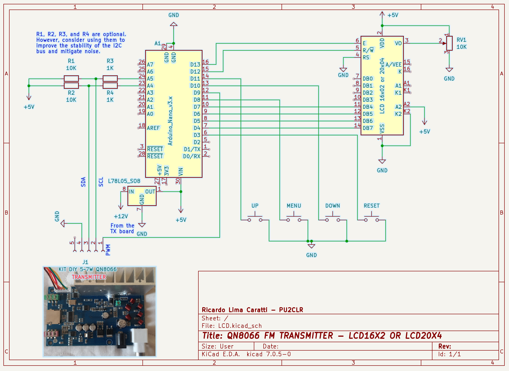

# QN8066 Arduino Library and LCD 16x02 examples

## Arduino Nano and "KIT DIY 5~7W FM TRANSMITTER" schematic

The following schematic illustrates the connections between the Arduino Nano, the "KIT DIY 5~7W FM TRANSMITTER," and either the LCD 16x2 or the LCD 20x4. It is important to note that both the LCD 16x2 and the LCD 20x4 have the same pin configuration. This means that there are no electrical changes when using one or the other.

## Wire up on Arduino UNO, Nano or Pro mini

### LCD 16x2 or 20x4  

  | LCD                       | Device Pin / Label        |  Arduino Pin  |
  | ------------------------- | ------------------------- | ------------  |
  | LCD 16x2 or 20x4          | D4                        |     D7        |
  |                           | D5                        |     D6        |
  |                           | D6                        |     D5        |
  |                           | D7                        |     D4        |
  |                           | RS                        |     D12       |
  |                           | E/ENA                     |     D13       |
  |                           | RW & VSS & K (16)         |    GND        |
  |                           | A (15) & VDD              |    +Vcc       |

### DIY KIT 5˜7W FM TRANSMITTER

  | DIY KIT 5˜7W FM TRANSM.   | Device Pin / Label        |  Arduino Pin  |
  | --------------------------| ------------------------- | --------------|
  | QN8066 BOARD              | SDA                       |     A4        |
  |                           | SCLK                      |     A5        |
  |                           | PWM                       |     D9        |

### Buttons 
  
  | Buttons                   | Device Pin / Label        |  Arduino Pin  |
  | ------------------------- | ------------------------- | --------------|
  |                           | Menu                      |      8        |
  |                           | Left (Down / -)           |     10        |
  |                           | Right (Up / + )           |     11        |
  |                           | RESET                     |      3        |

