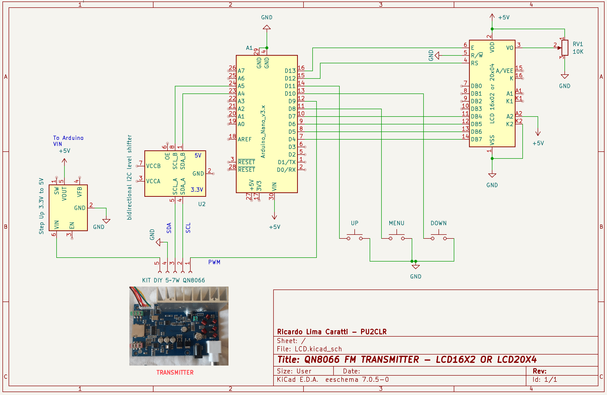
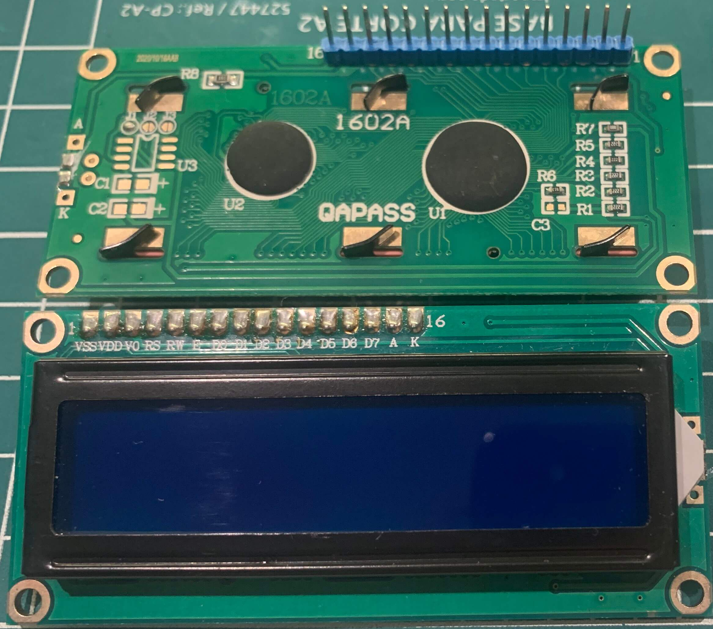
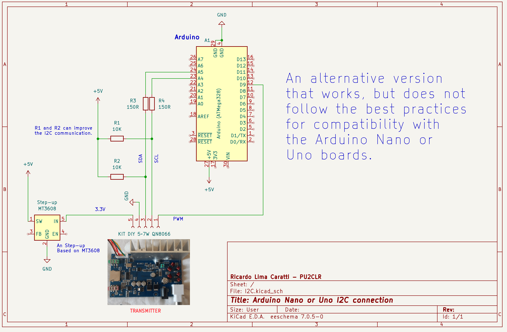
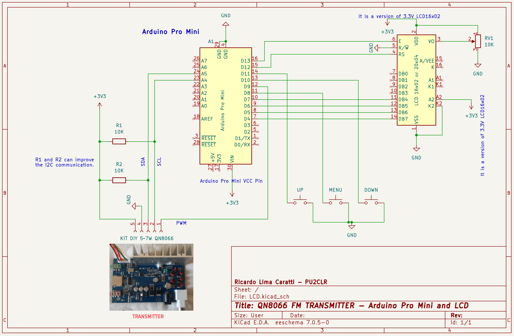
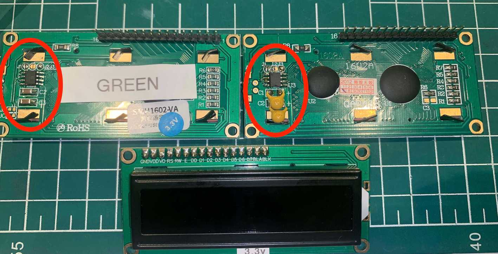
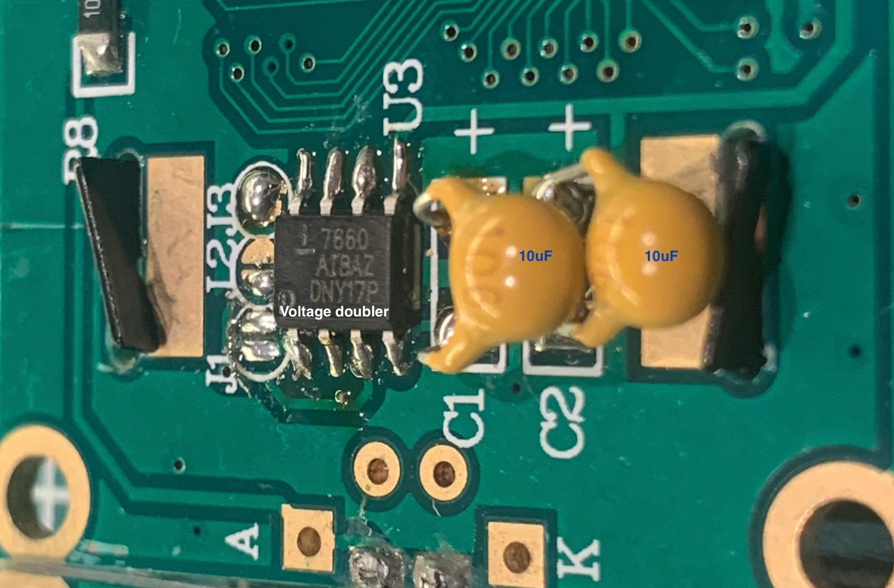
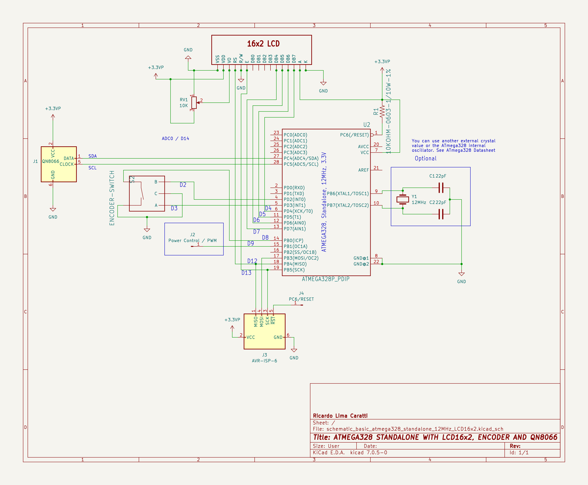
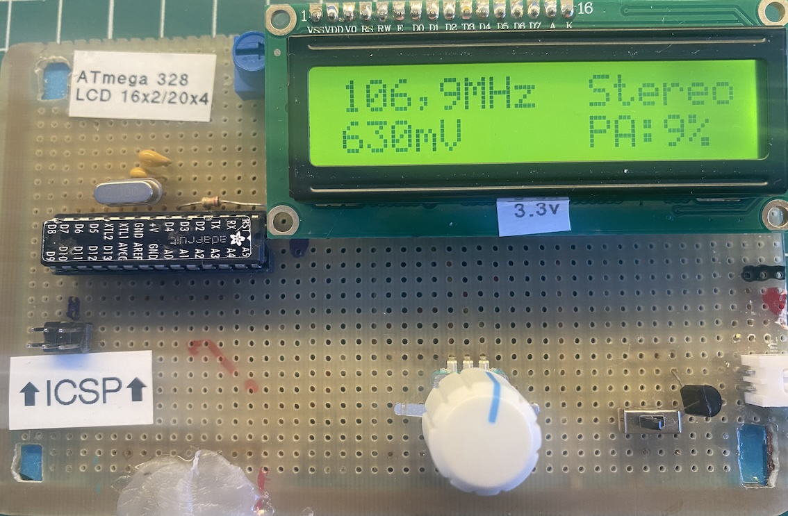
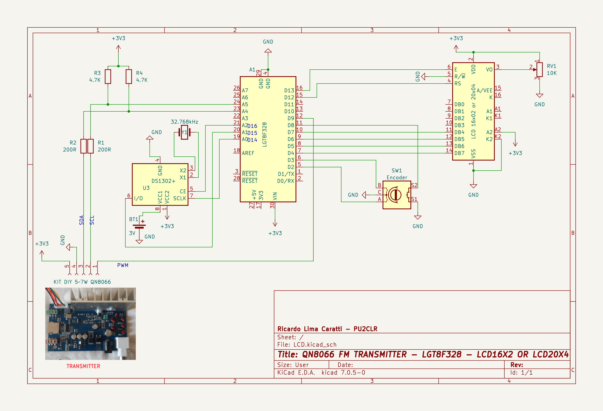

# QN8066 Arduino Library and LCD 16x02 examples

The sketches provided in this repository have been thoroughly tested and verified to work seamlessly on Arduino Uno, Nano, Pro Mini, and LGT8F328 boards. However, to ensure optimal performance and avoid potential issues, please carefully review the best practices outlined in the documentation for the QN8066 module, your specific controller board, and this repository. 

**Please note that the ESP32 version, found in this folder, has some variations in pin mappings and EEPROM handling compared to the Arduino and LGT8F328 versions. For specific details on these differences, consult the documentation within the sketch.**

## Arduino Nano and "KIT DIY 5~7W FM TRANSMITTER" schematic

The following schematic illustrates the connections between the Arduino Nano, the "KIT DIY 5~7W FM TRANSMITTER," and either the LCD 16x2 or the LCD 20x4. It is important to note that both the LCD 16x2 and the LCD 20x4 have the same pin configuration. This means that there are no electrical changes when using one or the other.

### Regular LCD16x02 (5V) 

## Wire up on Arduino UNO, Nano or Pro mini

### LCD 16x2 or 20x4  

  | LCD                       | Device Pin / Label        |  Arduino Pin  |
  | ------------------------- | ------------------------- | ------------  |
  | LCD 16x2 or 20x4          | D4                        |     D7        |
  |                           | D5                        |     D6        |
  |                           | D6                        |     D5        |
  |                           | D7                        |     D4        |
  |                           | RS                        |     D12       |
  |                           | E/ENA                     |     D13       |
  |                           | RW & VSS & K (16)         |    GND        |
  |                           | A (15) & VDD              |    +Vcc       |

### DIY KIT 5˜7W FM TRANSMITTER

  | DIY KIT 5˜7W FM TRANSM.   | Device Pin / Label        |  Arduino Pin  |
  | --------------------------| ------------------------- | --------------|
  | QN8066 BOARD              | SDA  (see *2)             |     A4        |
  |                           | SCLK (see *2)             |     A5        |
  |                           | PWM  (see *1)             |     D9        |

### Buttons 
  
  | Buttons                   | Device Pin / Label        |  Arduino Pin  |
  | ------------------------- | ------------------------- | --------------|
  |                           | Menu                      |      8        |
  |                           | Left (Down / -)           |     10        |
  |                           | Right (Up / + )           |     11        |

### IMPORTANT

#### (1) Communication Problem Between the KIT and the Microcontroller with PWM

**During various experiments, it was observed that several commands sent to the QN8066 (via I2C) had no effect. For instance, attempts to switch from "Stereo" to "Mono" mode, change the transmission frequency, among other commands, did not alter the transmitter's status. To work around this issue, the PWM must be disabled first, meaning it should not generate a pulse (0% duty cycle). After the command is sent, the PWM signal can be re-enabled. Doing that the system works well.**

#### (2) Compatibility Between the KIT and 5V Microcontroller Such as the Arduino Nano

**There are some important considerations when using a microcontroller like the Arduino Nano with the "DIY 5~7W FM Transmitter Kit". This kit is designed to work with a 3.3V controller, meaning the I2C bus is configured with pull-up resistors connected to the board's power supply. However, the Arduino Nano operates at 5V, producing a 5V signal on the I2C bus, which can cause instability in I2C communication. Additionally, the Arduino Nano will not operate stably when powered by a 3.3V supply (provided by the kit)**.

**The most straightforward and suitable solution, though not very practical, would be to modify the Arduino Nano to operate at 3.3V (by changing the crystal to 8MHz, among other modifications, including changing the bootloader). The most viable solution would be to use an "Arduino Pro Mini 3.3V". This way, no changes or adaptations would be necessary to connect the kit to the microcontroller**.

**For the Arduino Nano, the adaptation used in this example involves using a 3.3V to 5V voltage converter to power the Arduino and placing two 150-ohm resistors in series with the I2C bus and two pull-up 10K resistors connected to the I2C wires.  Although this is not best practice, it works to some extent. If you insist in using a Arduino Nano, a more appropriate solution would be to use a bidirectional I2C level shifter to make the I2C communication compatible with both the Arduino Nano and the kit**.

**Finally, the Arduino Nano was used in this example because it is widely used by most hobbyists. It's likely that many already have one at home, or even an Arduino Uno, which shares the same architecture**.

#### An alternative of connecting Arduino Nano and the KIT 

An alternative version that worked in my experiments, using a makeshift adaptation, does not follow the best practices for compatibility.

## Arduino Pro mini schematic 

An alternative version that worked in my experiments uses a makeshift adaptation and does not follow best practices for compatibility.

### LCD16x02 3.3V Version

### LCD16x02 5V modified to operate with 3.3V

The IC labeled "7660 AIBAZ DNY17P" is commonly known as the ICL7660. It is a DC-DC voltage converter that functions as a voltage inverter, converting a positive voltage to a negative voltage. This chip is widely used in applications where a negative voltage is needed from a positive power supply. In this case, you use it as a Voltage Doubler. 

  3.3V ---+---[7660]---+----> +6.6V (VOUT)

          |            |

         [C1]         [C2]

          |            |

         GND          GND

C1 and C2 are 10µF capacitors.

## STANDALONE ATMEGA328 WITH MENU CONTROLLED BY ENCODER

The STANDALONE ATMEGA328 version refers to using the ATmega328 microcontroller without the configurations found on Arduino boards. This setup requires a different programming interface (ISP) as well as specific settings for compilation. The crystal shown in the following circuit is optional. The ATmega328 can be configured with its internal 8MHz oscillator without any detriment to the application.

### Schematic

### Standalone ATmega328 Prptotype

Both the schematic and the sketch apply to the Arduino UNO, Nano, Pro Mini, or any other board based on the ATmega328. The operating voltage of each architecture should be considered according to the recommendations provided earlier.

### Wire up using the standalone ATmega328

The wiring for the standalone ATmega328 is the same as with the Nano, Uno, or Pro Mini versions. I only changed the menu button to digital pin D14/A0 to make it easier. But you can keep it on pin 8 if you want, just be careful with the physical connections.
It is worth noting that the Up/Right and Down/Left buttons have been replaced by the encoder, which uses pins 2 and 3 of the Arduino/ATmega328. This change is beneficial because these pins allow for interrupt configuration, making the interface more responsive.

| Device name               | Device Pin / Description  |  Arduino Pin  |
| --------------------------| --------------------      | ------------  |
|    LCD 16x2 or 20x4       |                           |               |
|                           | D4                        |     D7        |
|                           | D5                        |     D6        |
|                           | D6                        |     D5        |
|                           | D7                        |     D4        |
|                           | RS                        |     D12       |
|                           | E/ENA                     |     D13       |
|                           | RW & VSS & K (16)         |    GND        |
|                           | A (15) & VDD              |    +Vcc       |
| --------------------------| ------------------------- | --------------|
| QN8066                    |                           |               |
| DIY KIT 5˜7W              | ------------------------- | --------------|
|                           | SDA                       |     A4        |
|                           | SCLK                      |     A5        |
|                           | PWM                       |     D9        |
| --------------------------| --------------------------| --------------|
| Button                    |                           |               |
|                           | Menu                      |     D8        |
| Encoder                   |                           |               | 
|                           | Left                      |     D2        |
|                           | Right                     |     D3        |
| --------------------------| --------------------------|---------------|

### Arduino Nano or LGT8F328 with encoder and DS1302 RTC schematic

The following schematic presents a version of the controller with the LGT8F328 microcontroller integrated with an LCD, a Rotary Encoder, and a real-time clock based on the DS1302.

## Videos related to this example

* [QN8066 Arduino Library by PU2CLR - Part 2](https://youtu.be/3V40yuwN-Vk?si=ZDTcvcty_OK6Nm9N)
* [QN8066 Arduino Library by PU2CLR - Part 1](https://youtu.be/C69MqLq1cw8?si=xd4P6nIfzfCbaN0_)
* [QN8066 RX/TX FM DSP Arduino Library](https://youtu.be/cNQA_2QtBZk?si=Li1ocRp1A5LYIRh8)
