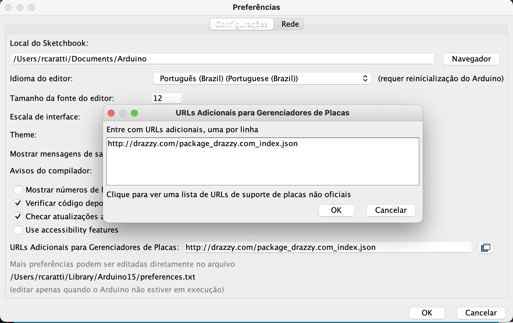

# Examples of using the QN8066 Arduino Library with  Attiny84 or Attiny85

This folder shows how you can use de QN8066 Arduino Library on the very small Attiny8X.
See the examples below. 

## Arduino IDE setup

The Attiny core board/plataform can be installed using the Arduino IDE boards manager. Insert the URL http://drazzy.com/package_drazzy.com_index.json on board manager. On menu Preferences, enter the "http://drazzy.com/package_drazzy.com_index.json" in "Additional Boards Manager URLs;

To setup ATtiny85 on Arduino IDE, go to Tools Menu, Board, Board Manager and install "ATTinyCore by Spence Konde". 

