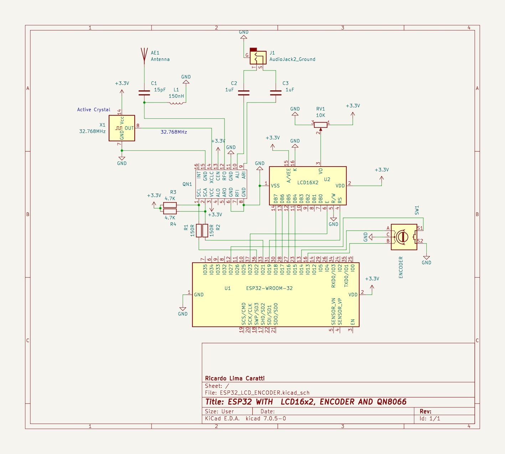

# ESP32, QN8066, LCD16x2 and Encoder basic setup

Before starting compiling ESP32 based sketches, you must configure your Arduino IDE. Follow the steps below:

* Install the last version of Arduino IDE
* Configure the ESP32 on Arduino IDE
  * Open the Arduino IDE and select the __Preferences...__ menu item.
  * Go to __Additional Boards Manager URLs:__ and add the URL: https://raw.githubusercontent.com/espressif/arduino-esp32/gh-pages/package_esp32_index.json
  * After adding the ESP32 URL, go to __Tools__ menu, select the __Boards__ item and then select __Boards Manager...__ option. Finally install ESP32 board.

## ESP32 Dev Module setup

Observe in the following diagram and table that the connections between the ESP32 and the QN8066, as well as the encoder and the LCD, refer to the GPIO and not to the physical pin number of the ESP32 module board. Carefully analyze the pin distribution of your ESP32 to make the correct connections

## Wire up ESP32 Dev Module, QN8066 and LCD16x02 or LCD16x04

| Device name               | Device Pin / Description  |  Arduino Pin  |
| --------------------------| --------------------      | ------------  |
|    LCD 16x2 or 20x4       |                           |               |
|                           | D4                        |  GPIO18       |
|                           | D5                        |  GPIO17       |
|                           | D6                        |  GPIO16       |
|                           | D7                        |  GPIO15       |
|                           | RS                        |  GPIO19       |
|                           | E/ENA                     |  GPIO23       |
|                           | RW & VSS & K (16)         |  GND          |
|                           | A (15) & VDD              |  +Vcc         |
| --------------------------| ------------------------- | --------------|
| QN8066                    |                           |               | 
|                           | VCC                       |  3.3V         |
|                           | SDIO / SDA (pin 2)        |  GPIO21 [1]   |
|                           | SCLK (pin 1)              |  GPIO22 [1]   |
| --------------------------| --------------------------| --------------|
| Encoder                   |                           |               |
|                           | A                         |  GPIO13       |
|                           | B                         |  GPIO14       |
|                           | PUSH BUTTON (encoder)     |  GPIO27       |
| PWM                       |                           |               |
|                           |                           |  GPIO12       | 

1. It can change if you are not using the ESP32 Dev Module. Check you ESP32 board pinout 

