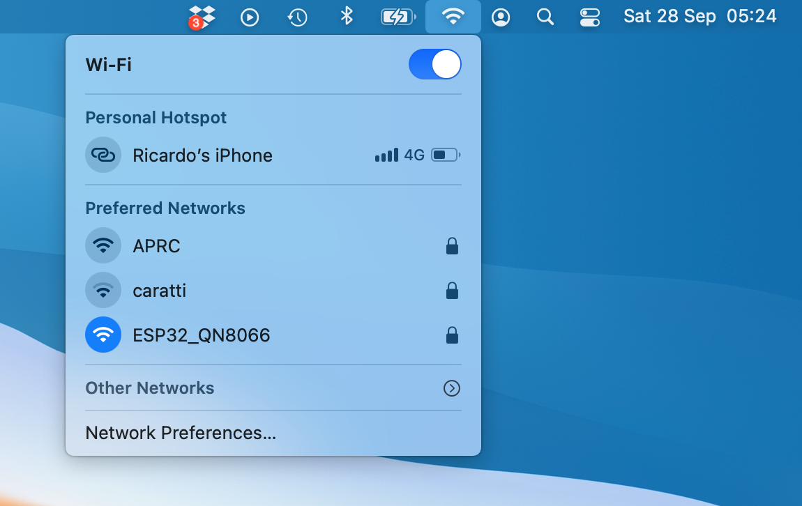
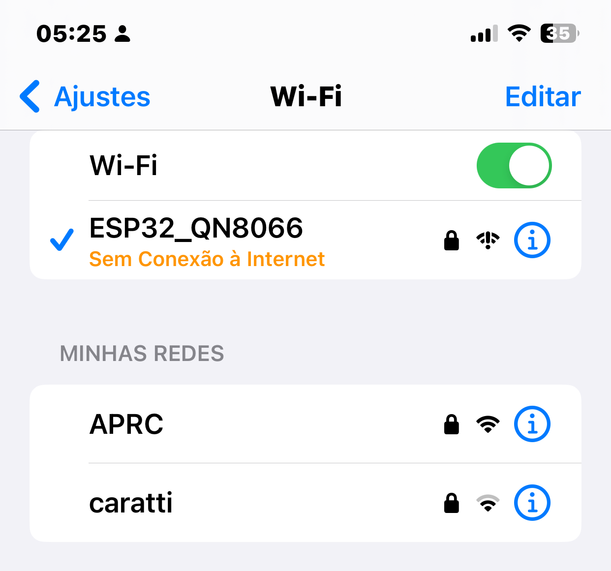
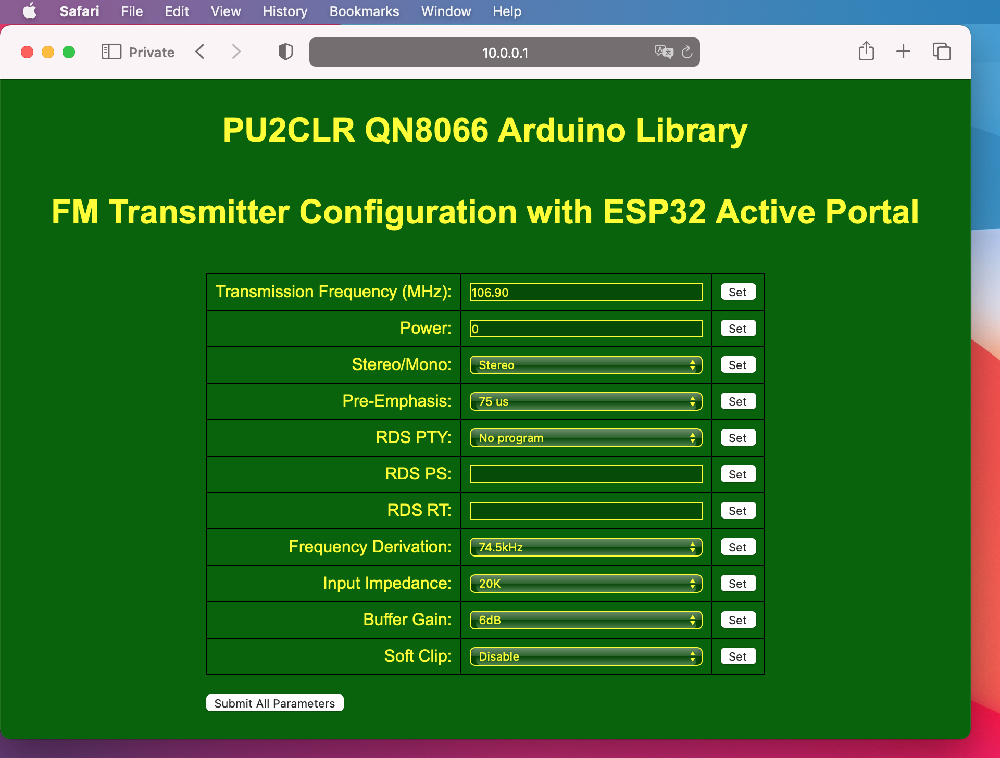
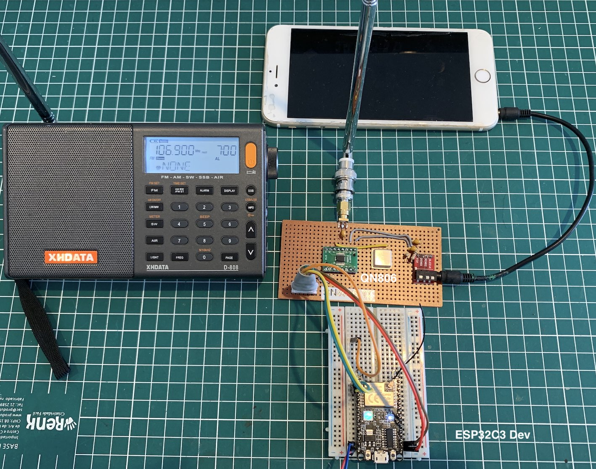
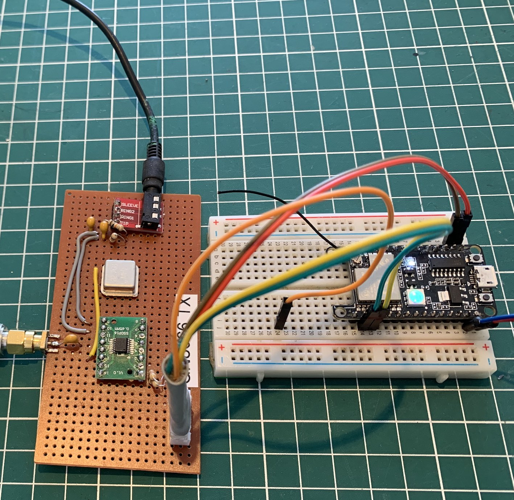

# ESP32 WEB ACTIVE PORTAL AND QN8066 FM TRANSMITTER

This application is very similar to the '[02_WEB_WIFI_ESP32_QN8066](../02_ESP32_WEB_WIFI_QN8066/)' application, with one subtle difference: the ESP32 itself will provide its own internet network (Access Point), allowing you to configure the FM Transmitter by connecting your device (phone or computer) directly to the ESP32. This eliminates the need for another Wi-Fi network configured in your home or any similar setup.

## Requirements

### Hardware
- ESP32 development board (ESP32 Dev Module, ESP32C3 Dev Module, or compatible)
- QN8066 FM transmitter module
- Connecting wires
- Optional: External antenna for better transmission range

### Software
- Arduino IDE with ESP32 board package installed
- Required libraries:
  - WiFi (included with ESP32 board package)
  - WebServer (included with ESP32 board package)
  - DNSServer (included with ESP32 board package)
  - Wire (Arduino core library)
  - QN8066 (this library)

## How to Use

To use this application, follow these steps:

1. **Hardware Setup**: Wire the ESP32 and QN8066 according to the connection diagram in the [02_WEB_WIFI_ESP32_QN8066](../02_ESP32_WEB_WIFI_QN8066/) folder
2. **Upload Code**: Flash the `ESP32_ACTIVE_PORTAL_QN8066.ino` sketch to your ESP32
3. **Power On**: Connect power to the ESP32
4. **Connect to Access Point**: On your computer or mobile device, connect to the Wi-Fi network:
   - **SSID**: ESP32_QN8066
   - **Password**: esp32qn8066
5. **Access Web Interface**: Open a web browser and navigate to **10.0.0.1**
6. **Configure Transmitter**: Use the web interface to set frequency, power, and RDS parameters

### Access Point Credentials
- **Network Name (SSID)**: ESP32_QN8066
- **Password**: esp32qn8066
- **IP Address**: 10.0.0.1
- **Gateway**: 10.0.0.1
- **Subnet**: 255.255.255.0

### Important Notes
- The ESP32 creates its own Wi-Fi network - no internet connection required
- The web interface includes real-time clock functionality for RDS date/time
- Changes to transmitter settings may take a few seconds to be reflected
- Ensure your FM receiver is tuned to the frequency set in the interface

### Troubleshooting
- **Cannot see ESP32_QN8066 network**: Check ESP32 power and code upload
- **Cannot access 10.0.0.1**: Verify connection to ESP32_QN8066 network
- **Web page not loading**: Try refreshing browser or clearing cache
- **No FM transmission**: Check QN8066 connections and antenna

## ESP32 Access Point connection

The following image illustrates the connection of a computer to the ESP32 via the Access Point provided by the ESP32.

The following image illustrates the connection to the ESP32 from an iPhone.

The following image shows a web page provided by the ESP32.

## QN8066 and ESP32C3 Dev Module setup

The following images illustrate a homemade assembly of the QN8066 soldered onto an adapter board. An active 32.768 MHz crystal was used in this setup. An ESP32C3 Dev Module development board was used, but other boards such as the ESP32 Dev Module can also be used.

