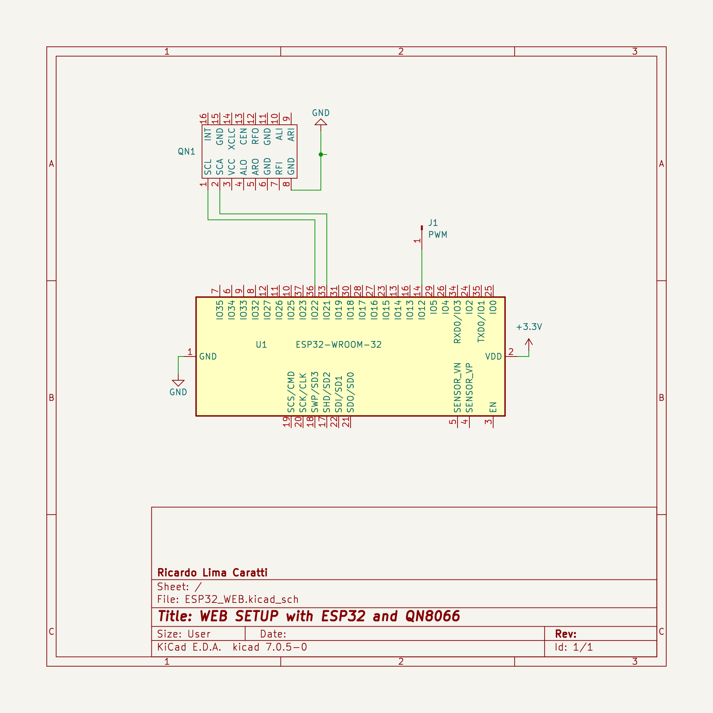
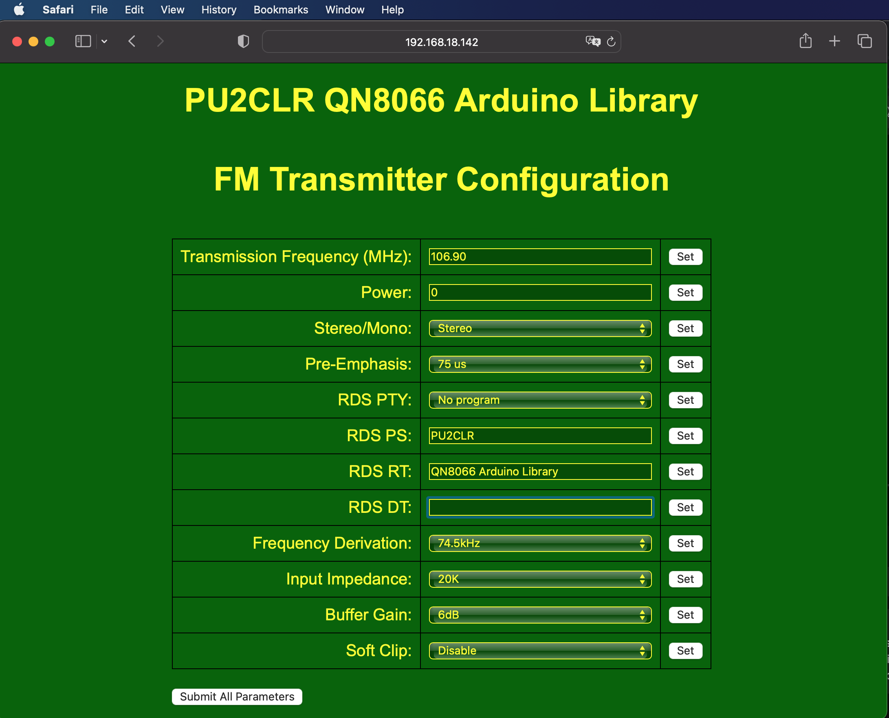

# FM transmitter based on QN8066 controlled by WEB Page

This folder contains a project based on the ESP32 with integrated Wi-Fi. The ESP32 is programmed to function as an HTTP server. A sketch has been developed to allow users to access and modify the parameters of the QN8066-based FM transmitter through a web browser on a mobile device or personal computer. This feature is particularly useful for dynamically updating RDS messages broadcast by the station.

## QN8066 and ESP32 WEB SCHEMATIC

## QN8066 ESP32 WEB SERVER CONTROL

## Video

