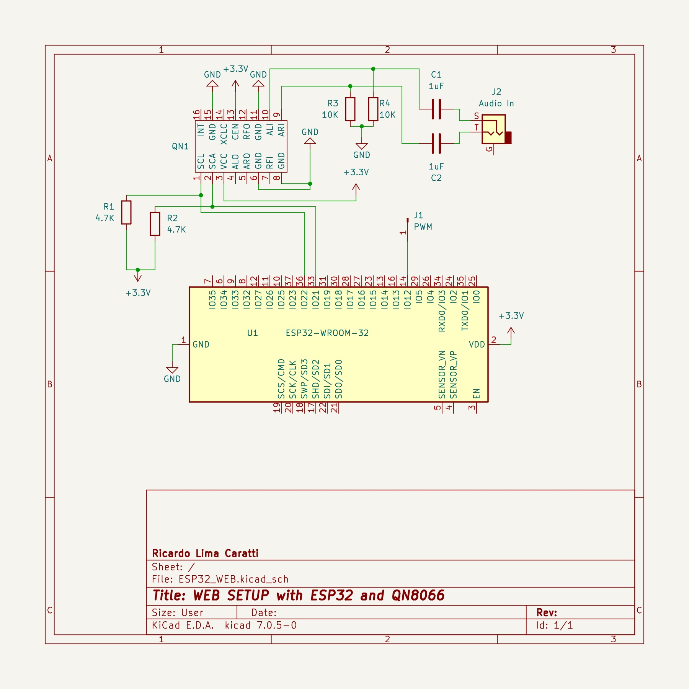

# FM transmitter based on QN8066 controlled by WEB Page

This folder contains a project based on the ESP32 with integrated Wi-Fi. The ESP32 is programmed to function as an HTTP server. A sketch has been developed to allow users to access and modify the parameters of the QN8066-based FM transmitter through a web browser on a mobile device or personal computer. This feature is particularly useful for dynamically updating RDS messages broadcast by the station.

Before starting compiling ESP32 based sketches, you must configure your Arduino IDE. Follow the steps below:

* Install the last version of Arduino IDE
* Configure the ESP32 on Arduino IDE
  * Open the Arduino IDE and select the __Preferences...__ menu item.
  * Go to __Additional Boards Manager URLs:__ and add the URL: https://raw.githubusercontent.com/espressif/arduino-esp32/gh-pages/package_esp32_index.json
  * After adding the ESP32 URL, go to __Tools__ menu, select the __Boards__ item and then select __Boards Manager...__ option. Finally install ESP32 board.
  

## QN8066 and ESP32 WEB SCHEMATIC

## QN8066 ESP32 WEB SERVER CONTROL

## Video

