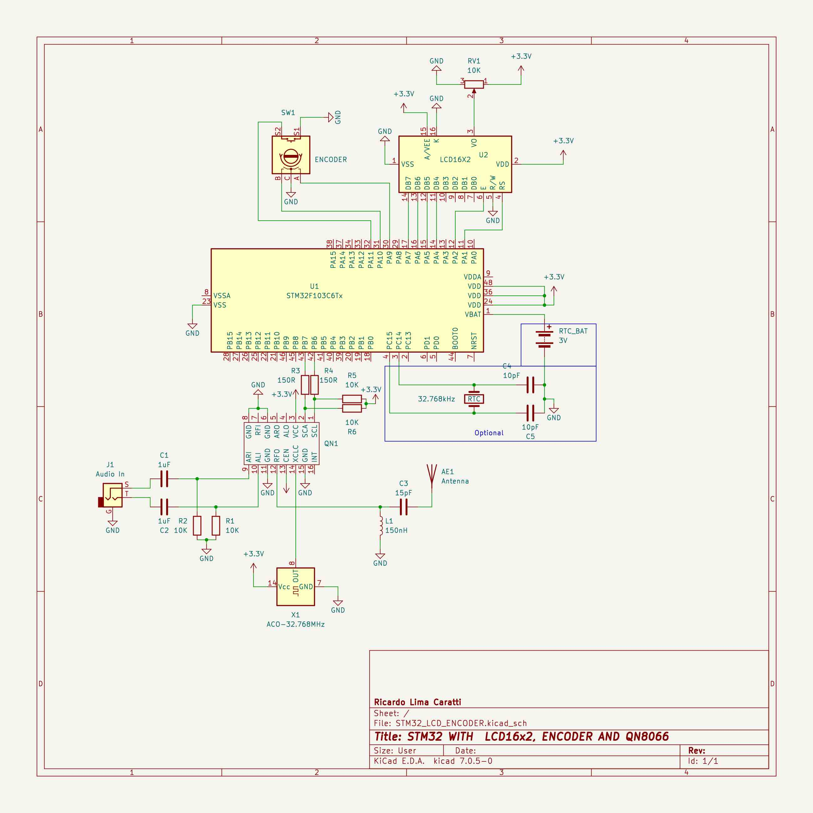

# STM32 and QN8066 setup

It is possible to set up the STM32 microcontroller and the QN8066 using the QN8066 Arduino Library, taking full advantage of the STM32’s powerful architecture. The STM32 offers high-performance processing with ARM Cortex cores, advanced peripherals, low power consumption, and flexible I/O configurations, making it a good  choice for precise and efficient control of the QN8066 FM transmitter.

## STM32 and Arduino IDE setup

It seems that there are several configuration options for STM32 with the Arduino IDE. However, the most robust approach at the time of writing this appears to be in the GitHub repository [Arduino core support for STM32 based boards](https://github.com/stm32duino/Arduino_Core_STM32). Follow the instructions from this repository to set up your Arduino IDE.

## STM32, LCD16x2, Encoder and QN8066 schematic

##  STM32, LCD16x2, Encoder and QN8066 prototype

The prototype assembled on a breadboard illustrates the configuration of the STM32 with the QN8066, a 16x2 LCD adapted to work with 3.3V, and a rotary encoder with a push button.

## Video

* [STM32 microcontroller and the QN8066 FM Transmitter](https://youtu.be/Y80ud6KVOTU?si=fTDgtkt9-0fRZk56)
