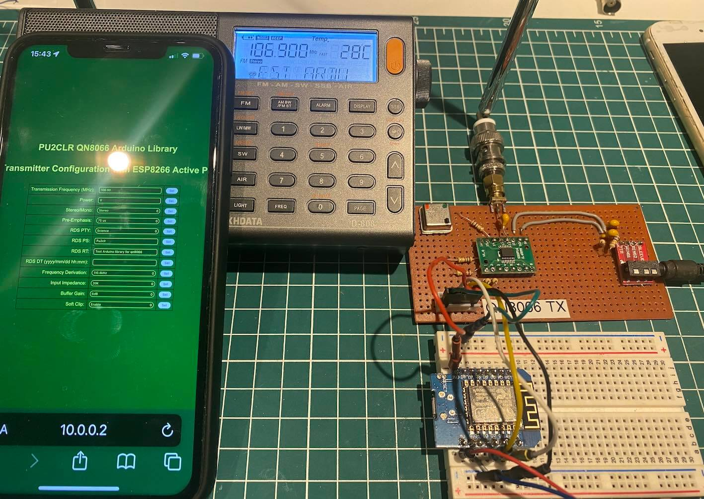

# ESP8266 and QN8066 SETUP

The ESP8266 is a microcontroller with built-in Wi-Fi connectivity, widely used in Internet of Things (IoT) projects due to its low cost and versatility. It offers advanced network capabilities, enabling the creation of HTTP servers and functioning as an Access Point, as well as connecting to Wi-Fi networks as a client.

The ESP8266 features a Tensilica Xtensa LX106 processor, running at 80 MHz (with the possibility of overclocking to 160 MHz). It includes 50 KB of RAM for programming and up to 4 MB of flash memory for firmware and data storage, depending on the variant. It provides multiple GPIOs to interface with sensors and actuators, and supports I2C, SPI, UART, and PWM protocols, expanding its compatibility with external peripherals. Its Wi-Fi module supports 802.11 b/g/n at 2.4 GHz, and it can operate in Station mode, Access Point mode, or both simultaneously (AP+Station).

Thanks to these features, the ESP8266 is ideal for various applications, such as home automation, remote sensor monitoring, and custom Wi-Fi access points. This example is yet another option for controlling a transmitter based on the QN8066 using Wi-Fi. It is very similar to the ESP32 version, as well as the NANO 33 IoT version, both also presented in this library.

## ESP8266 and QN8066 Basic Setup

The following diagram presents a basic configuration of the QN8066 and the ESP8266.

## ESP8266 and QN8066 prototype

## How to Use

### Requirements
- ESP8266 development board (NodeMCU, Wemos D1 Mini, or ESP8266 Dev Module)
- QN8066 FM transmitter module
- Arduino IDE with ESP8266 board package installed
- Required libraries:
  - ESP8266WiFi (included with ESP8266 board package)
  - Wire (Arduino core library)
  - QN8066 (this library)

### Setup Instructions

1) **Hardware Connection**: Wire the ESP8266 and QN8066 according to the diagram above
2) **Upload Code**: Flash the `ESP8266_ACCESS_POINT_WEB.ino` sketch to your ESP8266
3) **Connect to Access Point**: In your computer or mobile device, connect to the Wi-Fi network:
   - **SSID**: ESP8266_QN8066
   - **Password**: 12345678
4) **Access Web Interface**: Open your web browser and navigate to **10.0.0.2**
5) **Configure Transmitter**: Use the web interface to adjust frequency, power, and RDS settings

### Important Notes

- The ESP8266 creates its own Wi-Fi network (Access Point mode) - no internet router required
- Changes to transmitter parameters may take a few seconds to be reflected on your FM receiver
- Ensure your FM receiver is tuned to the frequency set in the web interface
- The default frequency is 106.9 MHz

### Troubleshooting

- **Cannot see ESP8266_QN8066 network**: Check if the ESP8266 is powered and the sketch uploaded correctly
- **Cannot access 10.0.0.2**: Ensure you're connected to the ESP8266_QN8066 network, not your home Wi-Fi
- **No audio transmission**: Verify QN8066 connections and antenna attachment
- **Web page doesn't load**: Try refreshing the browser or clearing cache

## Information

### Quick Start Summary

1) In your computer or mobile device, connect to Wi-Fi network: **ESP8266_QN8066** (password: **12345678**)
2) Open your web browser and navigate to **10.0.0.2**
3) Use the web interface to configure the FM transmitter settings
4) Tune your FM receiver to the frequency you set (default: 106.9 MHz)

**Note**: Depending on your receiver and the transmitter parameters you modify, it may take some time for changes to be noticed on the receiver.

After entering 10.0.0.2 in your web browser, the page below should appear.

## Video

* [ESP8266 controlling the QN8066 FM transmitter via Wi-Fi](https://youtu.be/WVRsd0P8aRI?si=kUDwbs8J0wA0sLLK)
