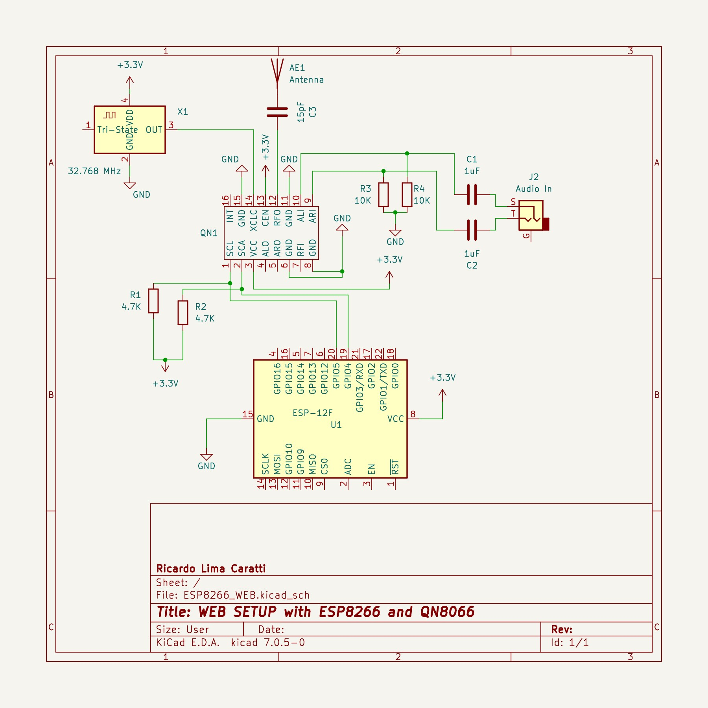

# ESP8266 and QN8066 SETUP

The ESP8266 is a microcontroller with built-in Wi-Fi connectivity, widely used in Internet of Things (IoT) projects due to its low cost and versatility. It offers advanced network capabilities, enabling the creation of HTTP servers and functioning as an Access Point, as well as connecting to Wi-Fi networks as a client.

The ESP8266 features a Tensilica Xtensa LX106 processor, running at 80 MHz (with the possibility of overclocking to 160 MHz). It includes 50 KB of RAM for programming and up to 4 MB of flash memory for firmware and data storage, depending on the variant. It provides multiple GPIOs to interface with sensors and actuators, and supports I2C, SPI, UART, and PWM protocols, expanding its compatibility with external peripherals. Its Wi-Fi module supports 802.11 b/g/n at 2.4 GHz, and it can operate in Station mode, Access Point mode, or both simultaneously (AP+Station).

Thanks to these features, the ESP8266 is ideal for various applications, such as home automation, remote sensor monitoring, and custom Wi-Fi access points. This example is yet another option for controlling a transmitter based on the QN8066 using Wi-Fi. It is very similar to the ESP32 version, as well as the NANO 33 IoT version, both also presented in this library.

## ESP8266 and QN8066 Basic Setup

The following diagram presents a basic configuration of the QN8066 and the ESP8266.

