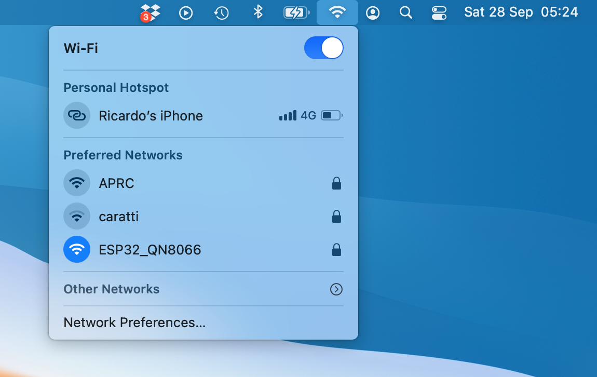
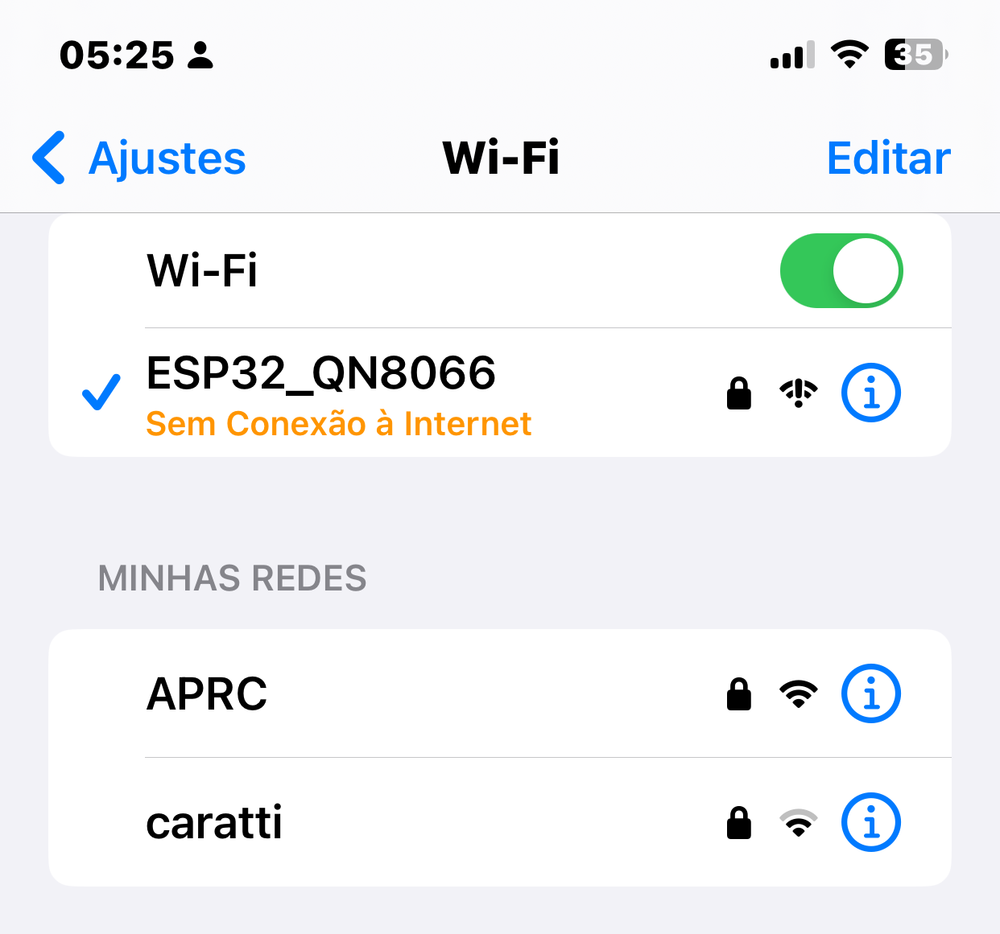

# ESP32 WEB ACTIVE PORTAL AND QN8066 FM TRANSMITTER

This application is very similar to the '[07_WEB_WIFI_ESP32_QN8066](https://github.com/pu2clr/QN8066/tree/main/examples/07_WEB_WIFI_ESP32_QN8066)' application, with one subtle difference: the ESP32 itself will provide its own internet network (Access Point), allowing you to configure the FM Transmitter by connecting your device (phone or computer) directly to the ESP32. This eliminates the need for another Wi-Fi network configured in your home or any similar setup.

To use this application, all you need to do is power on the ESP32, connect to the Wi-Fi network with the SSID ESP32_QN8066 (password esp32qn8066) via your computer or mobile device, and start controlling the transmitter through the web page.

To configure the ESP32 settings with the FM transmitter, please refer to the documentation in the folder [07_WEB_WIFI_ESP32_QN8066](https://github.com/pu2clr/QN8066/tree/main/examples/07_WEB_WIFI_ESP32_QN8066). Once the connections are set up and the sketch  ESP32_ACTIVE_PORTAL_QN8066.ino is uploaded, you can access the ESP32 by following these steps: 

1.  Connect your device to the Wi-Fi provided by the ESP32 (SSID: ESP32_QN8066, password: esp32qn8066); 
2.  Use a web browser and go to the address 10.0.0.1.

## ESP32 Access Point connection

The following image illustrates the connection of a computer to the ESP32 via the Access Point provided by the ESP32.

The following image illustrates the connection to the ESP32 from an iPhone.

The following image shows a web page provided by the ESP32.

