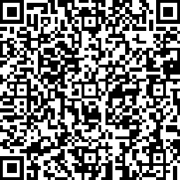

# QN8066 Arduino Library Examples 

This directory presents some examples with the transceiver QN8066 

There is a Facebook group called [QN80XX FM Transmitters & Receivers Enthusiasts](https://www.facebook.com/groups/qn80xx)  where the purpose is exchanging experiences with projects based on Quintic QN80XX IC family. You will be welcome there.

## IMPORTANT

__This project centers around a library designed to control QN8066 devices using the Arduino platform, with a primary focus on the "QN8066 Arduino Library" and its functionalities. The idea of this library is to offer users an abstraction layer for operating the QN8066 device. It is not the focus of the project author to address user interface issues. Therefore, please refrain from asking for assistance with displays, encoders, buttons, or any other components outside the scope of the "QN8066 Arduino Library." Thank you.__

## Notice to Users Regarding Examples and this library

The examples shown in this library use **106.9 MHz** as the test frequency. Consider changing this frequency to another of your preference. Be aware that the use of FM transmitters is regulated by the laws and regulations of each country. **It is crucial to ensure that your use of any FM transmitter complies with the applicable legal requirements and does not violate any broadcasting regulations**.

This library is still in its initial version. Although the implemented functions have been tested with the examples, it is possible that in some situations it may present issues or not respond as expected. Therefore, I ask users to contact me (pu2clr@gmail.com) to report any problems. I will do my best to resolve or clarify the issue as quickly as possible. Thank you.

## Active Crystal and Arduino Library setup 

The QN8066 requires an external clock signal on pin 14 (XCLK) to operate correctly. This signal, provided by a clock generator, can be either sinusoidal or square in form. The library includes specific functions for configuring this clock source, ensuring that the QN8066 receives the appropriate signal for efficient operation.

The reference clock for the QN8066 is 32.768 kHz. It is important that you use a signal source with this value or a multiple of this value. Thus, if you are using a 32.768 MHz active crystal, you must specify a divisor of 1000 to the system, indicating that the signal source value divided by 1000 will result in 32.768 kHz.

The table below shows some tested sources (active crystal or signal generator) and divider values.  

|   Source (kHz)  | Divider       | 
| --------------  | ------------- |
|  32.768         |      1        | 
|  < 1,310.720    | did not work  |   
|  1,310.720      |    40         | 
|  1,638.400      |    50         | 
|  3,276.800      |   100         | 
|  13,107.200     |   400         | 
|  16,384.000     |   500         | 
|  32,768,000     |  1000         |  

Note in the table above that values between 65.636 kHz and 1,310.720 kHz did not work. Only an active crystal of 32.768 kHz or a multiple of this value above or equal to 1,310.720 kHz worked in the tests conducted by the author of this library. By default, this library assumes that you are using a 32.768 MHz signal source.

See some functions of this library that deal with QN8066 external source clock: 

* [setup()](https://pu2clr.github.io/QN8066/extras/apidoc/html/group__group02.html#gaea0b761c45ccf8a361a84aedaaa91bb2)
* [setXtal()](https://pu2clr.github.io/QN8066/extras/apidoc/html/group__group02.html#ga84ef4ffd06a76d817114cbd2e222f6e5)

The pictures below show some active crystals used during the tests.

## Documentation 

[See Arduino Library Documentation](https://pu2clr.github.io/QN8066/extras/apidoc/html/index.html)

## Donate 

If you find this project useful, consider making a donation so that the author of this library can purchase components and modules for improvements and testing of this library. [Click here to donate](https://www.paypal.com/donate/?business=LLV4PHKTXC4JW&no_recurring=0&item_name=Consider+making+a+donation.+So%2C+I+can+purchase+components+and+modules+for+improvements+and+testing+of+this+library.&currency_code=USD) or use the QR code below.

 