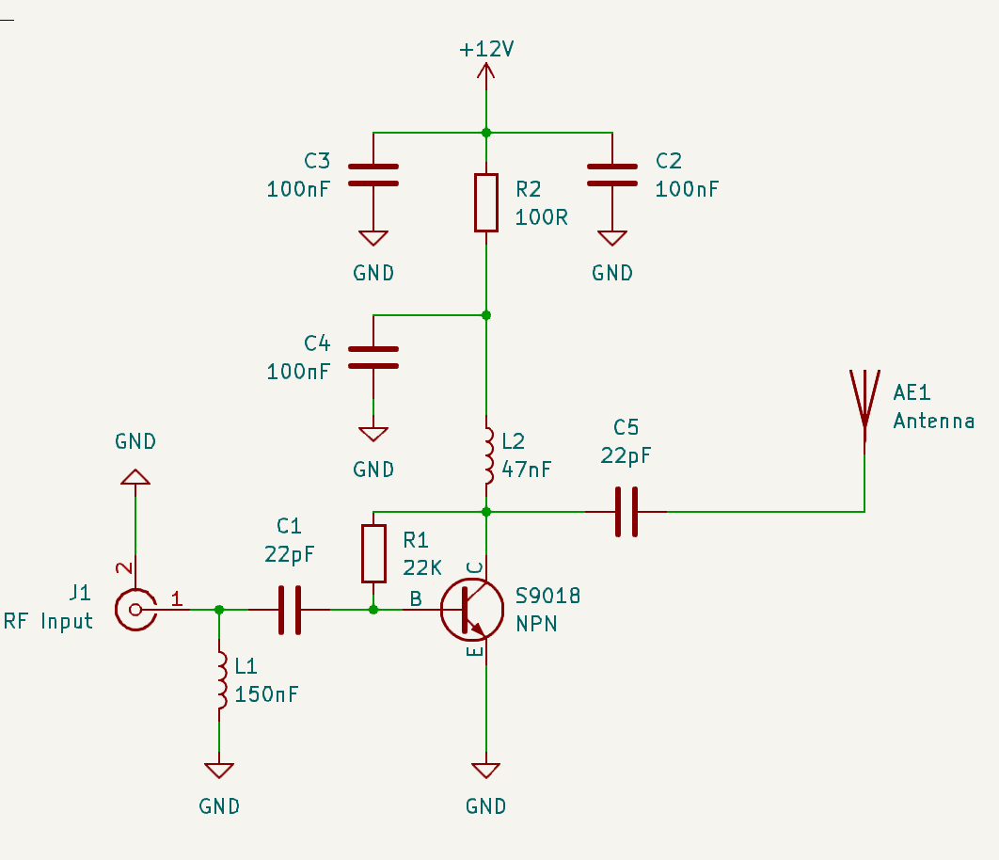

# Various subjects related to the contents of this repository

1. [About RDS](./#packaging-and-transmitting-rds-messages-using-the-qn8066)
2. [Practical Guide to Building an Inductor Using Copper Wire](./#practical-guide-to-building-an-inductor-using-copper-wire)
3. [Small RF Amplifier for QN8066 base on S9018](./#small-rf-amplifier-for-qn8066)

## Packaging and transmitting RDS messages using the QN8066

By Ricardo Lima Caratti - 2024

### Introduction 

The growing popularity of Arduino and the need for a more accessible development platform for the QN8066 microcontroller motivated the development of this library (PU2CLR QN8066 Arduino Library). By providing an intuitive and familiar interface to Arduino users, this library aims to democratize access to the QN8066 and streamline the development of projects involving FM radio transmissions with additional information via RDS.

The Radio Data System (RDS) allows digital information to be transmitted alongside traditional FM radio broadcasts. To effectively send RDS data, such as station names, it's essential to understand the specific structure and bit sequences involved. This paper presents a study on the implementation of the Radio Data System (RDS) using the QN8066 microcontroller. The study addresses the methodology for packaging and transmitting additional digital information, such as the station name, along with the FM radio signal. To this end, the structure of RDS data and the configuration of the QN8066 to generate and transmit these packets efficiently are detailed.

### RDS Message Format

#### Basic Concepts

Before starting with the information that will help implement the RDS functions for the QN8066, it is important to understand some terms and concepts.

Block: A block is the basic unit of data in RDS. Each block contains 26 bits of useful data and 10 error-checking bits, totaling 36 bits. From the perspective of the QN8066, it is important to highlight that, for implementation purposes, only the first 16 bits are used, with the remaining bits being handled or generated by the QN8066 itself for internal control.

Group: A group is a collection of four blocks that together form a complete RDS message. There are different types of groups, each designated for different types of data and applications.

#### Block Structure

Each block in RDS has the following structure:

|    Bits     |  Description   |          
| ----------- | -------------- |                    
|  0-15	      | Useful data (16 bits)   |
|  16-25      | Checksum (10 bits) for error checking |
|  26-35      |	Synchronization bits (not included in the block's data but part of the transmission structure) |
| 

#### Types of Blocks

| Block  | Description |
| ------ | ----------- |
|   1    | Contains the Program Identification (PI) code |
|   2    | Contains the group application code and other variable information depending on the group type |
|   3    | May contain additional data or repeat the PI code, depending on the group type and version |
|   4    | Contains the specific data for the RDS service (e.g., station name) |

### Structure and Function of Each Block in Specific Groups

#### Block 1: Program Identification (PI) Code

| Bits  | Description | 
| ----  | ----------- | 
| 0-15  | PI Code - a unique identifier for the radio station |
| 16-25 | Checksum (error-checking code calculated internally by the QN8066) |

PI Code Function: Identifies the radio station. This code is essential for allowing receivers to identify the source of the radio signal.

**You don't need to calculate the Checksum to implement RDS services on the QN8066. This control is handled by the QN8066 itself. Basically, all you need to do is correctly fill in the PI Code.**

##### PI Code Structure

The PI code is a 16-bit binary value (4 hexadecimal digits), and its structure is as follows:

* Country Identifier (First 4 Bits) - The first 4 bits of the PI code represent the country identifier. This helps to differentiate stations in different countries. For example, the code 0x1 might represent one country, while 0x2 represents another. 
* Program Type (Next 4 Bits) - The next 4 bits indicate the program type. This categorizes the type of content being broadcast, such as music, news, sports, etc.
* Program Reference Number (Last 8 Bits) - The last 8 bits provide a unique reference number for the specific station or program.

###### Example

Let's consider an example PI code: 0x1234.

* 0x1: Country identifier
* 0x2: Program type
* 0x34: Program reference number

#### Block 2: Group Application Code and Variable Information

| Bits  | Description | 
| ----  | ----------- | 
| 0-3	| Group Type Code (A3, A2, A1, A0) |
|  4	| Group Version Code (B0) |
|  5	| Traffic Program Indicator (TP) |
| 6-10	| Program Type Code (PTY) |
| 11-15	| Additional data (variable depending on the group) |

Function: Specifies the type of data being transmitted and includes information such as program type (e.g., news, music) and whether the station transmits traffic information.

#### Block 3: Additional Data or PI Repetition

Can contain additional data related to the group or repeat the PI code (especially in version B groups).

| Bits  | Description | 
| ----  | ----------- | 
| 0-15	|  Additional data or PI code (depending on the group type and version) |
| 16-25	|  Checksum (processed internally by the QN8066) |

When the  Block 3 is not just a repetition of Block 1, it contents of Block 3 can vary depending on the type and version of the group. Here are some examples of how Block 3 can be used:

##### Group Type 0A and 0B: 

1. In Group 0A, Block 3 contains a list of Alternative Frequencies (AF) that the receiver can use to find the same station on a different frequency.
2. In Group 0B, Block 3 is a repetition of the PI code found in Block 1.

##### Group Type 1A and 1B:

* In Group 1A, Block 3 contains Program Item Number (PIN) information, which identifies specific programs broadcast by the station.
* In Group 1B, Block 3 is a repetition of the PI code found in Block 1.

##### Group Type 2A and 2B:

* In Group 2A, Block 3 contains part of the 64-character Radiotext (RT) message.
* In Group 2B, Block 3 is used to transmit 32 characters of Radiotext (RT).

##### Group Type 3A:

* In Group 3A, Block 3 is used to transmit Open Data Applications (ODA) information.

##### Group Type 4A:

* In Group 4A, Block 3 is used to transmit Clock Time and Date (CT) information.

##### Group Type 5A and 5B:

* In Group 5A, Block 3 is used to transmit Transparent Data Channels (TDC) information.
* In Group 5B, Block 3 is a repetition of the PI code found in Block 1.

These examples show that the content of Block 3 depends on the type and version of the group. Here is an overview of the most common groups and the content of Block 3 for each:

| Type and group version | Description   |
| ---------------------- | ------------- |
| 0A                     | Alternative Frequencies (AF) |
| 0B                     | PI Code |
| 1A                     | Program Item Number (PIN) |
| 1B                     | PI Code |
| 2A                     | Radiotext (part 1) |
| 2B	                 | Radiotext (part 2) |
| 3A    	             | Open Data Applications (ODA) |
| 4A	                 | Clock Time and Date (CT) |
| 5A	                 | Transparent Data Channels (TDC) |
| 5B	                 | PI Code|

##### Block 4: Specific Data for RDS Service

| Bits  | Description | 
| ----  | ----------- | 
| 0-15	| Specific service data (e.g., Program Service name, PS) |
| 16-25 | Checksum (processed internally by the QN8066) |

Function: Contains specific RDS service data, such as the station name or text messages.

Practical Example: Group Type 0B for Transmitting Station Name

A group type 0B is used to transmit the station name (PS - Program Service). Let's see how each block is structured in this context:

###### Block 1:

   Bits 0-15	 PI code (example: 0x1234)

###### Block 2:

| Bits  | Description | 
| ----  | ----------- | 
|  0-3	| Group Type Code (0000 for type 0) |
|   4	| Group Version (1 for version B) |
|   5   | Traffic Indicator (0 or 1) |
| 6-10  | Program Type Code (e.g., 00100 for news) |
| 11-15 | Additional data (zeros if not used) |

###### Block 3:

Bits 0-15	 PI code (repetition)

###### Block 4:

Bits 0-15	 Station name data (two ASCII characters, e.g., 'RA')

This implementation considers the concepts of blocks and groups in RDS, detailing each block within the group type 0B to transmit the station name.

## Practical Guide to Building an Inductor Using Copper Wire

To create inductor using copper wire, you can follow a practical approach. The inductance of an inductor depends on factors such as the number of turns, the coil diameter, and the coil length. Here's a basic method to calculate and build your inductor:

### Inductance formula for an air-core coil

Where:
- \(L\) is the inductance in microhenries (\(\mu H\)),
- \(r\) is the radius of the coil in inches,
- \(N\) is the number of turns,
- \(l\) is the length of the coil in inches.

### Determine the wire and coil form

- **Choose the wire diameter**: Thin wire, like enameled copper wire (22 AWG or 24 AWG), is recommended for winding small coils.
- **Coil radius**: Choose a cylindrical object with the desired diameter (e.g., a pen or a screw) to use as a mold.

### Choose approximate dimensions

For such a small inductance, you can try a **radius of 3 to 5 mm (0.12 to 0.2 inches)** and a low number of turns.

### Experimental adjustment

Building such small inductors often requires fine adjustments. The final inductance can vary depending on how tightly the wire is wound and other factors like tension.

### Tools to measure inductance

Use an inductance meter (LCR meter) to check the inductance value. For instance, if you need a 150 nH inductor and don't achieve 150 nH initially, you can adjust the number of turns or the coil diameter accordingly.

### Practical Example

- If you use a mold with a **5 mm diameter** (0.2 inches) and wind about **5 to 7 turns**, you should be close to achieving a 150 nH inductance.

The table below gives approximate values for the number of turns and coil diameter required for each inductance. The actual results may vary depending on the wire used, coil length, and other factors.

| Inductance | Diameter (mm) | Diameter (inches) | Turns |
|------------|----------------|-------------------|-------|
| 47 nH      | 3 mm           | 0.12 inches       | 3     |
| 100 nH     | 4 mm           | 0.16 inches       | 4     |
| 150 nH     | 5 mm           | 0.20 inches       | 5-7   |
| 200 nH     | 6 mm           | 0.24 inches       | 8     |
| 500 nH     | 8 mm           | 0.31 inches       | 10-12 |
| 1 µH       | 10 mm          | 0.39 inches       | 15-18 |

You can also simulate these parameters using an [online inductor calculator](https://www.translatorscafe.com/unit-converter/pt-BR/calculator/coil-inductance/#google_vignette) or make experimental adjustments based on your measurements.

## Small RF Amplifier for QN8066

