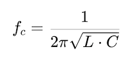
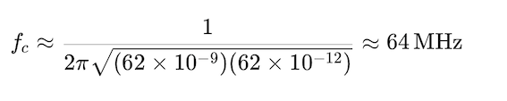
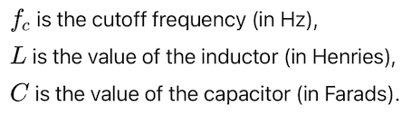
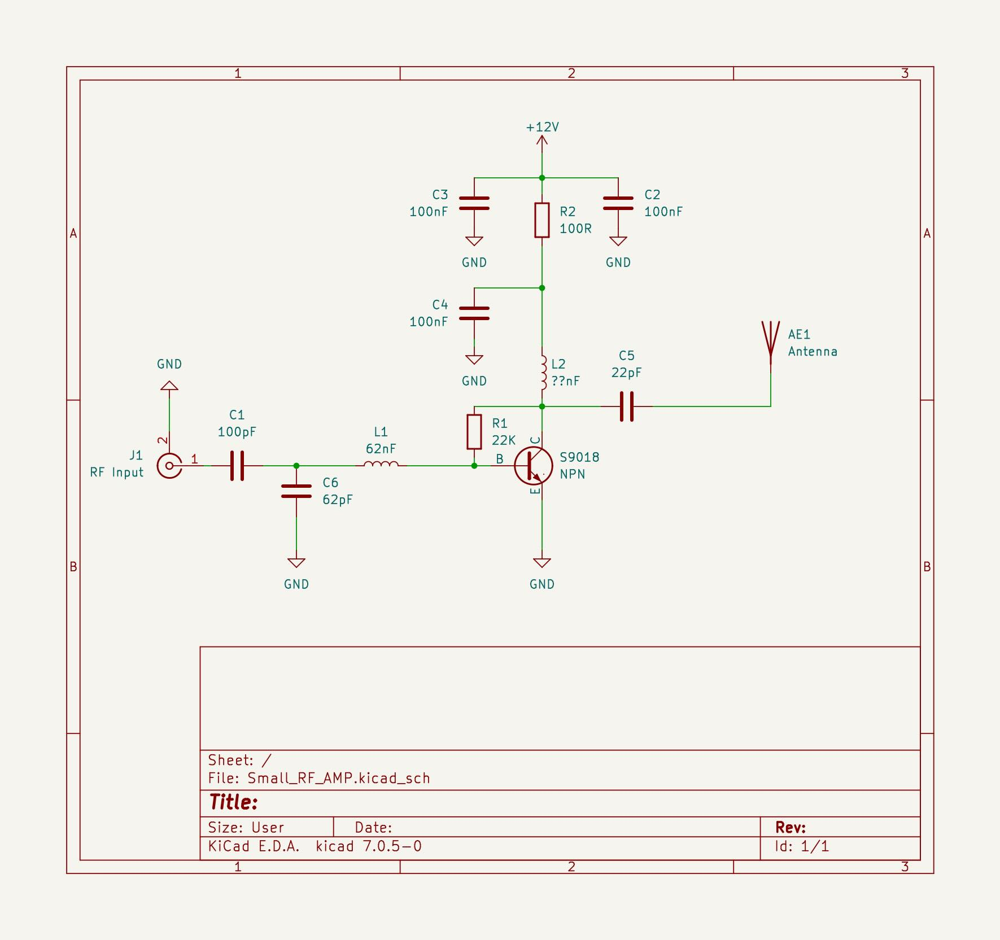
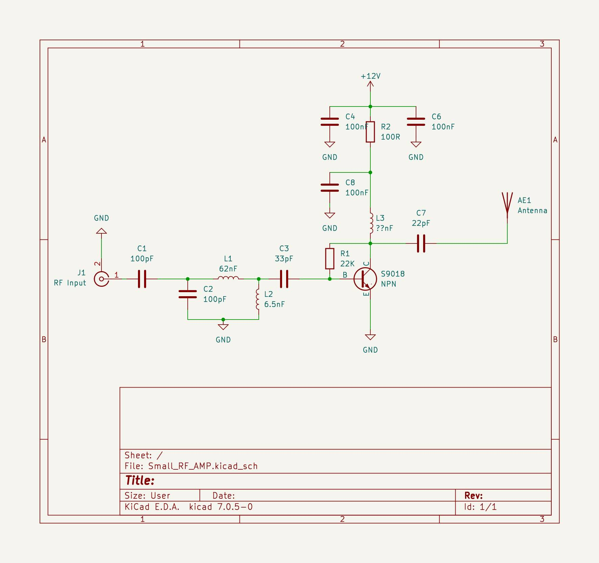

# Various subjects related to the contents of this repository

1. [About RDS](./#packaging-and-transmitting-rds-messages-using-the-qn8066)
2. [Practical Guide to Building an Inductor Using Copper Wire](./#practical-guide-to-building-an-inductor-using-copper-wire)
3. [Small RF Amplifier for QN8066 base on S9018](./#small-rf-amplifier-for-qn8066)

## Packaging and transmitting RDS messages using the QN8066

By Ricardo Lima Caratti - 2024

### Introduction 

The growing popularity of Arduino and the need for a more accessible development platform for the QN8066 microcontroller motivated the development of this library (PU2CLR QN8066 Arduino Library). By providing an intuitive and familiar interface to Arduino users, this library aims to democratize access to the QN8066 and streamline the development of projects involving FM radio transmissions with additional information via RDS.

The Radio Data System (RDS) allows digital information to be transmitted alongside traditional FM radio broadcasts. To effectively send RDS data, such as station names, it's essential to understand the specific structure and bit sequences involved. This paper presents a study on the implementation of the Radio Data System (RDS) using the QN8066 microcontroller. The study addresses the methodology for packaging and transmitting additional digital information, such as the station name, along with the FM radio signal. To this end, the structure of RDS data and the configuration of the QN8066 to generate and transmit these packets efficiently are detailed.

### RDS Message Format

#### Basic Concepts

Before starting with the information that will help implement the RDS functions for the QN8066, it is important to understand some terms and concepts.

Block: A block is the basic unit of data in RDS. Each block contains 26 bits of useful data and 10 error-checking bits, totaling 36 bits. From the perspective of the QN8066, it is important to highlight that, for implementation purposes, only the first 16 bits are used, with the remaining bits being handled or generated by the QN8066 itself for internal control.

Group: A group is a collection of four blocks that together form a complete RDS message. There are different types of groups, each designated for different types of data and applications.

#### Block Structure

Each block in RDS has the following structure:

|    Bits     |  Description   |          
| ----------- | -------------- |                    
|  0-15	      | Useful data (16 bits)   |
|  16-25      | Checksum (10 bits) for error checking |
|  26-35      |	Synchronization bits (not included in the block's data but part of the transmission structure) |
| 

#### Types of Blocks

| Block  | Description |
| ------ | ----------- |
|   1    | Contains the Program Identification (PI) code |
|   2    | Contains the group application code and other variable information depending on the group type |
|   3    | May contain additional data or repeat the PI code, depending on the group type and version |
|   4    | Contains the specific data for the RDS service (e.g., station name) |

### Structure and Function of Each Block in Specific Groups

#### Block 1: Program Identification (PI) Code

| Bits  | Description | 
| ----  | ----------- | 
| 0-15  | PI Code - a unique identifier for the radio station |
| 16-25 | Checksum (error-checking code calculated internally by the QN8066) |

PI Code Function: Identifies the radio station. This code is essential for allowing receivers to identify the source of the radio signal.

**You don't need to calculate the Checksum to implement RDS services on the QN8066. This control is handled by the QN8066 itself. Basically, all you need to do is correctly fill in the PI Code.**

##### PI Code Structure

The PI code is a 16-bit binary value (4 hexadecimal digits), and its structure is as follows:

* Country Identifier (First 4 Bits) - The first 4 bits of the PI code represent the country identifier. This helps to differentiate stations in different countries. For example, the code 0x1 might represent one country, while 0x2 represents another. 
* Program Type (Next 4 Bits) - The next 4 bits indicate the program type. This categorizes the type of content being broadcast, such as music, news, sports, etc.
* Program Reference Number (Last 8 Bits) - The last 8 bits provide a unique reference number for the specific station or program.

###### Example

Let's consider an example PI code: 0x1234.

* 0x1: Country identifier
* 0x2: Program type
* 0x34: Program reference number

#### Block 2: Group Application Code and Variable Information

| Bits  | Description | 
| ----  | ----------- | 
| 0-3	| Group Type Code (A3, A2, A1, A0) |
|  4	| Group Version Code (B0) |
|  5	| Traffic Program Indicator (TP) |
| 6-10	| Program Type Code (PTY) |
| 11-15	| Additional data (variable depending on the group) |

Function: Specifies the type of data being transmitted and includes information such as program type (e.g., news, music) and whether the station transmits traffic information.

#### Block 3: Additional Data or PI Repetition

Can contain additional data related to the group or repeat the PI code (especially in version B groups).

| Bits  | Description | 
| ----  | ----------- | 
| 0-15	|  Additional data or PI code (depending on the group type and version) |
| 16-25	|  Checksum (processed internally by the QN8066) |

When the  Block 3 is not just a repetition of Block 1, it contents of Block 3 can vary depending on the type and version of the group. Here are some examples of how Block 3 can be used:

##### Group Type 0A and 0B: 

1. In Group 0A, Block 3 contains a list of Alternative Frequencies (AF) that the receiver can use to find the same station on a different frequency.
2. In Group 0B, Block 3 is a repetition of the PI code found in Block 1.

##### Group Type 1A and 1B:

* In Group 1A, Block 3 contains Program Item Number (PIN) information, which identifies specific programs broadcast by the station.
* In Group 1B, Block 3 is a repetition of the PI code found in Block 1.

##### Group Type 2A and 2B:

* In Group 2A, Block 3 contains part of the 64-character Radiotext (RT) message.
* In Group 2B, Block 3 is used to transmit 32 characters of Radiotext (RT).

##### Group Type 3A:

* In Group 3A, Block 3 is used to transmit Open Data Applications (ODA) information.

##### Group Type 4A:

* In Group 4A, Block 3 is used to transmit Clock Time and Date (CT) information.

##### Group Type 5A and 5B:

* In Group 5A, Block 3 is used to transmit Transparent Data Channels (TDC) information.
* In Group 5B, Block 3 is a repetition of the PI code found in Block 1.

These examples show that the content of Block 3 depends on the type and version of the group. Here is an overview of the most common groups and the content of Block 3 for each:

| Type and group version | Description   |
| ---------------------- | ------------- |
| 0A                     | Alternative Frequencies (AF) |
| 0B                     | PI Code |
| 1A                     | Program Item Number (PIN) |
| 1B                     | PI Code |
| 2A                     | Radiotext (part 1) |
| 2B	                 | Radiotext (part 2) |
| 3A    	             | Open Data Applications (ODA) |
| 4A	                 | Clock Time and Date (CT) |
| 5A	                 | Transparent Data Channels (TDC) |
| 5B	                 | PI Code|

##### Block 4: Specific Data for RDS Service

| Bits  | Description | 
| ----  | ----------- | 
| 0-15	| Specific service data (e.g., Program Service name, PS) |
| 16-25 | Checksum (processed internally by the QN8066) |

Function: Contains specific RDS service data, such as the station name or text messages.

Practical Example: Group Type 0B for Transmitting Station Name

A group type 0B is used to transmit the station name (PS - Program Service). Let's see how each block is structured in this context:

###### Block 1:

   Bits 0-15	 PI code (example: 0x1234)

###### Block 2:

| Bits  | Description | 
| ----  | ----------- | 
|  0-3	| Group Type Code (0000 for type 0) |
|   4	| Group Version (1 for version B) |
|   5   | Traffic Indicator (0 or 1) |
| 6-10  | Program Type Code (e.g., 00100 for news) |
| 11-15 | Additional data (zeros if not used) |

###### Block 3:

Bits 0-15	 PI code (repetition)

###### Block 4:

Bits 0-15	 Station name data (two ASCII characters, e.g., 'RA')

This implementation considers the concepts of blocks and groups in RDS, detailing each block within the group type 0B to transmit the station name.

## Practical Guide to Building an Inductor Using Copper Wire

To create inductor using copper wire, you can follow a practical approach. The inductance of an inductor depends on factors such as the number of turns, the coil diameter, and the coil length. Here's a basic method to calculate and build your inductor:

### Inductance formula for an air-core coil

Where:
- \(L\) is the inductance in microhenries (\(\mu H\)),
- \(r\) is the radius of the coil in inches,
- \(N\) is the number of turns,
- \(l\) is the length of the coil in inches.

### Determine the wire and coil form

- **Choose the wire diameter**: Thin wire, like enameled copper wire (22 AWG or 24 AWG), is recommended for winding small coils.
- **Coil radius**: Choose a cylindrical object with the desired diameter (e.g., a pen or a screw) to use as a mold.

### Choose approximate dimensions

For such a small inductance, you can try a **radius of 3 to 5 mm (0.12 to 0.2 inches)** and a low number of turns.

### Experimental adjustment

Building such small inductors often requires fine adjustments. The final inductance can vary depending on how tightly the wire is wound and other factors like tension.

### Tools to measure inductance

Use an inductance meter (LCR meter) to check the inductance value. For instance, if you need a 150 nH inductor and don't achieve 150 nH initially, you can adjust the number of turns or the coil diameter accordingly.

### Practical Example

- If you use a mold with a **5 mm diameter** (0.2 inches) and wind about **5 to 7 turns**, you should be close to achieving a 150 nH inductance.

The table below gives approximate values for the number of turns and coil diameter required for each inductance. The actual results may vary depending on the wire used, coil length, and other factors.

| Inductance | Diameter (mm) | Diameter (inches) | Turns |
|------------|----------------|-------------------|-------|
| 47 nH      | 3 mm           | 0.12 inches       | 3     |
| 100 nH     | 4 mm           | 0.16 inches       | 4     |
| 150 nH     | 5 mm           | 0.20 inches       | 5-7   |
| 200 nH     | 6 mm           | 0.24 inches       | 8     |
| 500 nH     | 8 mm           | 0.31 inches       | 10-12 |
| 1 µH       | 10 mm          | 0.39 inches       | 15-18 |

You can also simulate these parameters using an [online inductor calculator](https://www.translatorscafe.com/unit-converter/pt-BR/calculator/coil-inductance/#google_vignette) or make experimental adjustments based on your measurements.

## Small RF Amplifier for QN8066

The circuit below is designed around the 2SC9018 transistor and can be used to enhance the FM broadcasting performance of the QN8066. It is straightforward, utilizing only a single 2SC9018 transistor and a few passive components.

Here I attempt to implement a high-pass filter (above 64 MHz). A first-order LC high-pass filter can be implemented using a series inductor and a parallel capacitor at the output.

Capacitor C1: Eliminates the 1.8V BIAS from the RF output of the QN8066, allowing only the RF signal to pass.

where 

#### L = 62nF and C = 62pF  

fc =~ 82MHz 

#### L = 100nF and C = 100pF  

fc =~ 50MHz

## With band-pass filter from 64MHz to 109MHz

1. C1 (100 pF): Acts as a coupling capacitor, eliminating the 1.8V BIAS and allowing the RF signal to pass.
2. L1 (62 nH): Forms part of the high-pass section, blocking frequencies below 64 MHz.
3. C2 (100 pF): Works with L1 to create the high-pass filter.
4. C3 (33 pF): Forms part of the low-pass section, blocking frequencies above 109 MHz.
5. L2 (6.5 nH): Works with C3 to create the low-pass filter.

## C/C++ compiler, optimization and more

### Efficient Use of Libraries in Microcontroller Applications

Among the common myths about using this library alongside others is the assumption that it could significantly increase the final code size, making the application unfeasible for many microcontrollers. However, it is essential to highlight that, although the library contains extensive code, a large portion serves to provide directives to the C/C++ compiler and does not necessarily translate into executable code. Examples include type definitions (typedef), data structures (struct), and unions (union). Additionally, modern compilers and linkers offer powerful optimization features, notably [Link Time Optimization (LTO)](https://gcc.gnu.org/projects/lto/lto.pdf), which eliminates unused symbols and code, ensuring the final binary is lean and efficient. These optimizations, combined with dead code elimination and [inlining strategies](https://ethz.ch/content/dam/ethz/special-interest/infk/ast-dam/documents/Theodoridis-ASPLOS22-Inlining-Paper.pdf), reduce the overhead, making the use of complex libraries feasible even in resource-constrained environments.

In light of this, to make the most of your application, it is essential to have a deep understanding of the microcontroller architecture you are working with, as well as the tools you are using, such as the compiler and linker.

#### The Evolution of C/C++ Compilers in the Last Decade: Key Innovations

Over the past decade, C and C++ compilers have undergone significant evolution, driven by the need for better performance, security, and compatibility with modern hardware. Compiler technologies have adapted to support new programming paradigms, optimize code for energy efficiency, and integrate more closely with hardware. Below are some of the key innovations in C/C++ compilers in recent years.

##### 1. **Link Time Optimization (LTO)**
LTO allows the compiler to perform optimizations across multiple translation units, linking them more efficiently by eliminating unused code and inlining functions across different files. This results in smaller binaries and improved runtime performance. Both GCC and LLVM have increasingly refined their LTO capabilities over the years.

##### 2. **Just-In-Time (JIT) Compilation Integration**
With the rise of JIT frameworks and languages like Rust, C++ has integrated better with JIT paradigms. LLVM’s **Clang** compiler, in particular, has made strides in supporting runtime code generation, enabling highly dynamic applications that use on-the-fly compilation to optimize execution.

##### 3. **Support for New Standards: C++11 to C++20 and Beyond**
Modern compilers have kept pace with the rapid evolution of the C++ language, incorporating features from C++11, C++14, C++17, and C++20. These features include lambda expressions, smart pointers, concurrency models, and concepts, enabling developers to write cleaner and more expressive code. With C++23 on the horizon, compilers are evolving to support modules for better compilation times and improved code organization.

##### 4. **Parallel and Vectorized Execution**
Compilers now offer better support for **SIMD (Single Instruction, Multiple Data)** operations, with auto-vectorization capabilities becoming more reliable. This allows applications to take full advantage of modern processors with multiple cores and vector units. GCC and Clang, for example, have improved their ability to recognize patterns suitable for vectorization and parallel execution.

##### 5. **Profile-Guided Optimization (PGO)**
PGO enables compilers to optimize code based on actual runtime behavior. Developers can run a version of the application to gather data on frequently executed paths, and the compiler uses this data to optimize those paths more aggressively in future builds. This technique has become standard in high-performance systems to maximize efficiency.

##### 6. **Improved Debugging and Error Diagnostics**
Modern C/C++ compilers, especially Clang, have focused on providing **better error messages and diagnostics**. This reduces the time spent debugging and improves developer productivity. Compilers now suggest potential fixes, offer more descriptive error messages, and provide more detailed warnings about unsafe code practices.

##### 7. **Enhanced Security Features**
To combat vulnerabilities such as buffer overflows, modern compilers now support security-related features such as **Address Sanitizer (ASan)**, **Control Flow Integrity (CFI)**, and **Stack Canaries**. These tools help identify and mitigate potential vulnerabilities during development, enhancing the safety of C and C++ applications.

##### 8. **Compiler-Assisted Code Analysis and Static Analyzers**
Compilers are increasingly integrated with **static analysis tools** to identify bugs and potential security flaws before runtime. These tools examine code paths to ensure compliance with safety standards and detect undefined behavior, which is essential for critical systems like embedded and automotive applications.

##### 9. **Cross-Compilation and Multi-Architecture Support**
With the growing diversity of hardware platforms, compilers have improved support for cross-compilation. Developers can now target ARM, RISC-V, and other architectures more easily. This has been critical in embedded development, where code must run on constrained devices with specialized processors.

##### 10. **Modular Build Systems and Faster Compilation Times**
The introduction of modules in C++20 aims to address one of the longest-standing issues with C++: slow compilation times. Compilers are being adapted to support modules, which allow developers to organize code more efficiently, reducing build times and improving dependency management.

##### 11. **Integration with Cloud Development Environments**
The trend towards **cloud-based development environments** has influenced compilers to integrate better with CI/CD pipelines. Developers can now leverage cloud-based compiler services that provide consistent builds across environments and offer remote debugging capabilities.

##### Conclusion
The evolution of C/C++ compilers over the past decade reflects the changing landscape of software development, where performance, security, and maintainability are paramount. Innovations such as Link Time Optimization, Profile-Guided Optimization, better error diagnostics, and security tools have significantly improved the capabilities of these compilers. As C++ continues to evolve, compilers will play a crucial role in ensuring that developers can build high-performance, safe, and maintainable applications, both for current architectures and the future of computing.

### **LLVM's Clang Compiler: A Deep Dive into Its Evolution and Key Features**

**Clang**, part of the LLVM project, has become one of the most important C, C++, and Objective-C compilers in the past decade. Its rapid rise to prominence is due to its modular design, comprehensive diagnostics, and close alignment with modern development needs. Below, we explore the key aspects of Clang’s evolution, major innovations, and its impact on the software development ecosystem.

---

### 1. **Modular Design and Integration with LLVM**
Clang is built as a front-end for the **LLVM (Low-Level Virtual Machine)** compiler infrastructure. This modular architecture allows developers to combine Clang with other LLVM tools such as the JIT compiler, static analyzers, and sanitizers. Its seamless integration with LLVM enables cross-platform compatibility and simplifies support for new architectures such as ARM, RISC-V, and WASM.

---

### 2. **Best-in-Class Diagnostics and Error Reporting**
Clang revolutionized compiler diagnostics by introducing **clear and actionable error messages**. Unlike traditional compilers, which often present cryptic errors, Clang offers **contextual suggestions** and highlights relevant portions of the code. This focus on developer experience has made it a favorite among programmers, significantly reducing debugging time.

---

### 3. **Compliance with the Latest C++ Standards**
Clang has been at the forefront of **adopting new C++ standards**. It was among the first compilers to fully implement features from C++11, C++14, C++17, and C++20. This includes key language improvements like lambda expressions, concepts, structured bindings, and modules, helping developers keep pace with evolving best practices.

---

### 4. **Link Time Optimization (LTO) and Thin LTO**
LTO in Clang enables **whole-program optimization**, where the compiler analyzes multiple modules together during the linking stage to remove unused code and inline functions across translation units. Clang also supports **Thin LTO**, which provides a scalable and faster alternative, making it ideal for large codebases by balancing optimization and build time.

---

### 5. **Clang’s Role in Compiler Toolchains and IDEs**
Clang is widely adopted as the default compiler on several platforms, such as **macOS** and **iOS**, and is integrated into tools like **Xcode**. Its modular APIs have allowed it to become a critical component in **CI/CD pipelines** and static analysis tools, making it an essential part of many organizations' software delivery infrastructure.

---

### 6. **Sanitizers for Better Code Quality**
Clang offers a suite of **runtime sanitizers** that detect memory leaks, buffer overflows, and undefined behavior. Key sanitizers include:

- **Address Sanitizer (ASan):** Detects memory access errors such as out-of-bounds access.
- **Undefined Behavior Sanitizer (UBSan):** Identifies operations with undefined behavior.
- **Thread Sanitizer (TSan):** Detects data races in multithreaded code.

These sanitizers are crucial for improving code quality and security, especially in critical software systems.

---

### 7. **Clang’s Just-In-Time (JIT) Compilation Support**
Clang works closely with LLVM to enable **JIT compilation**. This capability allows developers to generate machine code at runtime, which is useful in applications requiring dynamic code generation, such as gaming engines, machine learning frameworks, and database query optimizers.

---

### 8. **Cross-Compilation Capabilities and Targeting Multiple Architectures**
Clang's design allows it to target **multiple architectures** with ease. It supports x86, ARM, RISC-V, and PowerPC, among others, and has strong support for **WebAssembly (WASM)**, enabling code to run efficiently in web environments. This flexibility makes Clang a top choice for both embedded developers and web application engineers.

---

### 9. **Compiler as a Service (LibClang)**
Clang exposes many of its internal functions via **LibClang**, a C API that allows developers to interact programmatically with the compiler. This makes it possible to build tools such as static analyzers, custom linters, and code formatters, empowering developers to extend Clang’s functionality to meet specific project needs.

---

### 10. **Adoption by Major Projects and Ecosystems**
Clang has seen widespread adoption in the industry, including being:

- The **default compiler for macOS and iOS** development.
- A core component of the **Android NDK** toolchain.
- Widely used in **game development** (e.g., Unreal Engine supports Clang).
- Preferred in **high-performance computing** environments for scientific simulations.

Clang’s influence extends beyond its own use, as its innovations in diagnostics and optimization have inspired improvements in other compilers like GCC.

---

### 11. **Support for LSP (Language Server Protocol)**
Clang is used as the foundation for **Clangd**, a language server that provides real-time code completion, diagnostics, and symbol searches. Clangd integrates into **IDEs** like Visual Studio Code, offering developers advanced C/C++ features with minimal configuration, improving productivity.

---

### 12. **Ongoing Innovations: C++ Modules and Beyond**
Clang continues to evolve with a focus on **C++ modules**, introduced in C++20, which aim to solve the long-standing issue of slow compilation times. By precompiling code modules, Clang can deliver **faster builds** and better dependency management. Future versions of Clang are expected to fully support **C++23** features and integrate even more tightly with emerging hardware technologies.

---

### Conclusion
LLVM's Clang compiler has transformed the way developers write, optimize, and maintain C/C++ applications. Its commitment to modern standards, unparalleled diagnostics, and cutting-edge optimizations have made it the go-to compiler for a wide range of industries. As Clang continues to evolve, it will remain at the forefront of compiler technology, driving further innovation and ensuring that developers can build fast, reliable, and secure applications.

