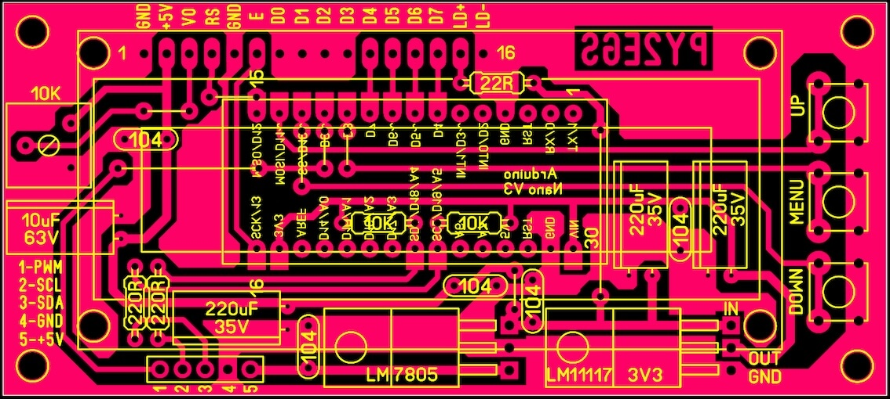
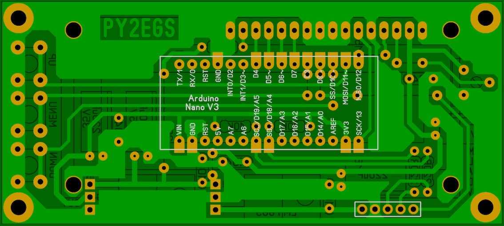
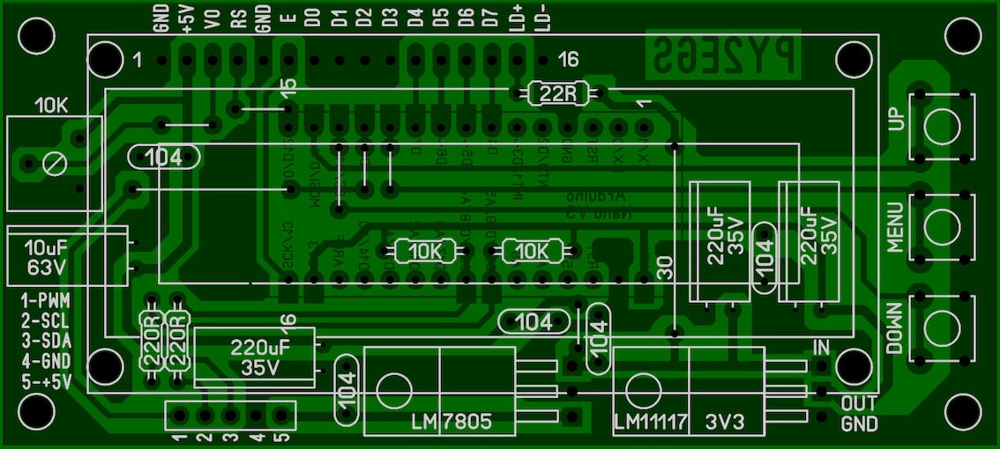

# Arduino Nano V3 and LCD16x2 board 

This layout, contributed by Mr. Elionaldo Gomes da Silva,  PY2EGS, refers to an implementation using the Arduino Nano with an LCD16x2. The board layout was developed using Sprint-Layout 6.0 software. 

